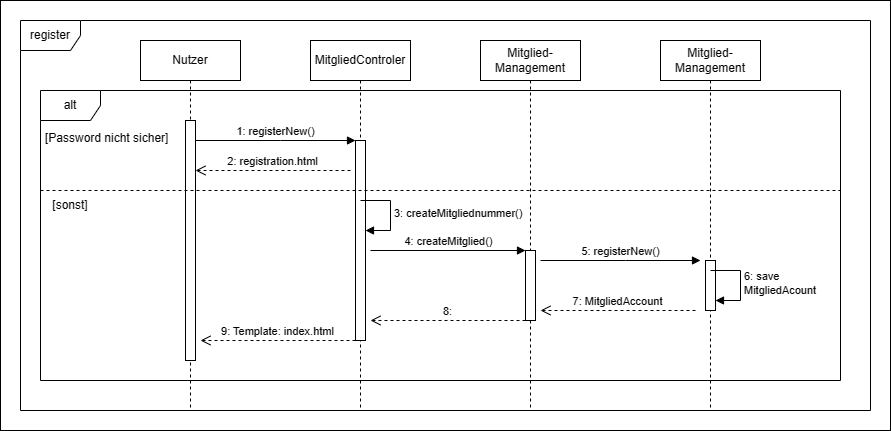

[options="header"]
[cols="1, 3, 3"]
|===
|Version | Bearbeitungsdatum   | Autor 
|...	| ... | ...
|===

= Entwicklerdokumentation

== Einführung und Ziele
=== 1.1 Aufgabenstellung
Der Dresdner Kletterverein möchte sich der digitalen Wende stellen und seine analogen Verfahren digitalisieren. Dadurch erhofft er sich zeitliche Ersparnisse sowie eine bessere Anknüpfung an die jungen Leute. Der Verein hat sich folgende Schwerpunkte überlegt, die er gerne als Erstes angehen möchte. 
Der Verein wünscht sich eine Webseite, die alle Gäste nutzen können und verschiedene Informationen zeigt. Ganz wichtig ist dabei, dass Gäste sowie Mitglieder über neuste Nachrichten aus dem Vereinsleben informiert werden oder sich informieren können. Dazu gehören vor allem über Brand- und Brutschutz. Weiterhin möchte sich der Verein neuen möglichen Mitglieder durch ein ansprechendes Design modern und fortschrittlich vorstellen.  Fokus soll dabei auf der Entstehungsgeschichte des Vereines sowie den aktuellen Entwicklungen liegen.

Im Allgemeinen sollen alle Systeme durch verschiedene Nutzergruppen genutzt werden. Bei einer Analyse wurden die folgenden allgemeinen Gruppen gefunden: Mitarbeiter, Mitglieder und Ehrenamtlichen. Eine Person kann dabei auch mehr Rollen zugleich besitzen, da Ehrenamtliche zugleich immer auch Mitglieder sind. Wichtig ist jedoch, dass jeder nur die Rechte besitzt und auf die Seiten zugreifen kann, die durch die Geschäftsführung festgelegt wurden. Um alle Personen des Vereines zu managen, wünscht sich der Verein eine Person- und Mitgliederverwaltung. Dabei sollen neue Personen und Mitglieder angelegt, bearbeitet und gelöscht werden können. Es ist es sehr wichtig, dass dieser Überblick klar strukturiert ist und die wichtigen Informationen bereitstellt, da häufig neue Anträge gestellt werden. Für die einfache Interaktion zwischen Mitgliedern und den Mitarbeitern kann sich jedes Mitglied online registrieren, wobei hierzu eine Mitgliedsnummer nötig ist. Danach muss das Mitglied von einer berechtigten Person freigeschaltet werden, bevor es als aktiv zählt. Derzeitig wird das DAV (Deutscher Alpenvereins) Identifikationsschema genutzt und soll weiterhin angewendet werden. 

Neben der Verwaltung der Mitglieder und Nutzer hat der Verein einen Shop in dem er verschiedenes verkauft. Darunter fallen zum Beispiel T-Shirt, Pullover und Jacken mit dem Logo des Vereines sowie wichtiges Kletterequipment für die Halle und draußen.Der Shop soll nur von Mitgliedern einsehbar sein. Dabei soll Bezahlung sowie über das in der Mitgliedschaft hinterlegte Konto als auch bar vor Ort möglich sein.

Neben den normalen Systemen eines Vereines wie der Shop benötigt der Kletterverein eine zusätzliche zugeschnittene Softwarekomponente. Diese soll die vollbrachte ehrenamtlicher Arbeit der Ehrenamtlichen Mitarbeiter erfassen und auswerten. Mittels einer Entschädigung soll für Engagement im Verein jeder belohnt werden. Das System soll dabei folgende Funktionen besitzen. Eine zuständige Person der Mitarbeiter kann Klettergruppen anlegen, die Teilnehmer und
Trainer beinhaltet. Dabei muss deine neu angelegte Klettergruppe bereits einen festgelegten Trainer haben. Dieser kann, nachdem die Gruppe angelegt wurde Teilnehmer hinzufügen oder als inaktiv setzen. Teilnehmer können den Trainer per Mail kontaktieren, um sich für die Gruppe anzumelden. Teilnehmer und Trainer sind dabei ausschließlich Mitglieder des Vereines. Ist eine Trainingsstunde abgehalten worden, kann der Trainer diese in einem Art Trackingsystem eintragen. Erfasst werden soll dabei: Datum, Ort, Anfangs- und Endzeit und wer alles anwesend war. Alles soll sehr übersichtlich und strukturiert sein, da die Altersspanne der Personen sehr
groß ist, die mit diesem System arbeiten müssen. Im Rhythmus von 1/2 Jahr werden dann die Unterrichtsstunden zusammengerechnet und abgerechnet. Die erfassten Daten sollen jedoch von der Geschäftsführung jederzeit einschtbar sein.

Besonders an dem Kletterverein ist der Verleih für seine ehrenamtlichen Mitarbeiter. Diese können verschiedene Dinge für eine bestimmte Zeit ausleihen. Pro Element gibt es eine Historie wer es wann ausgeliehen hatte, sowie wann es zurückgegeben wurde. Für das Ausleihen ist nur die Mitgliedsnummer bei der Abholung notwendig.

Damit sich die Nutzer gut in der online Anwendung zurechtfinden, soll es Hilfestellungen und Hinweise zu den Eingaben geben. Zudem müssen bestimmte Sicherheitsvorschriften, die vom Staat vorgegeben wurden, erfüllen werden. Dazu gehören die Passwortstärke und die Speicherung von Passwörtern in der Form eines Hashes. Eine mögliche Ergänzung wäre eine text-to-speech Funkion.

=== 1.2 Qualitätsziele

Um die Qualität der Anwendung zu messen, müssen Qualitätsanforderungen definiert werden, die erfüllt werden müssen.

Erhaltbarkeit::
Dieses Merkmal steht für den Grad an Effektivität und Effizienz, mit dem ein Produkt oder System geändert werden kann, um es zu verbessern, zu korrigieren oder an Änderungen der Umgebung und der Anforderungen anzupassen.

Nutzbarkeit::
Grad, in dem ein Produkt oder System von bestimmten Benutzern verwendet werden kann, um bestimmte Ziele mit Effektivität, Effizienz und Zufriedenheit in einem bestimmten Nutzungskontext zu erreichen.

Sicherheit::
Grad, in dem ein Produkt oder System Informationen und Daten so schützt, dass Personen oder andere Produkte oder Systeme den ihrer Art und Berechtigung entsprechenden Grad des Datenzugriffs erhalten.

Die folgende Tabelle zeigt, welche Qualitätsanforderungen in welchem Umfang erfüllt werden müssen.
In der ersten Spalte sind die Qualitätsanforderungen aufgeführt, während in den folgenden Spalten die Priorität durch ein "x" gekennzeichnet ist.

1 = Nicht wichtig ..
5 = Sehr wichtig
[options="header", cols="3h, ^1, ^1, ^1, ^1, ^1"]
|===
|Qualitätsanforderung | 1 | 2 | 3 | 4 | 5
|Erhaltbarkeit        |   |   | x |   |
|Nutzbarkeit          |   |   |   | x |
|Sicherheit           |   |   | x |   |
|===

== Randbedingungen
=== Hardware-Vorgaben
Eine Liste der für die Ausführung und Nutzung der Anwendung erforderlichen Geräte/Hardware.

* Server
* Computer
* Tastatur
* Maus
* Bildschirm

=== Software-Vorgaben
Eine Liste der für die Ausführung und Nutzung der Anwendung erforderlichen Software.

Die folgende (oder eine neuere) Java-Version ist erforderlich, um die Anwendung auszuführen:

* Java 19

=== Vorgaben zum Betrieb des Software
Die folgenden (oder neuere) Browser-Versionen sind für die Nutzung der Anwendung erforderlich:

* Internet Explorer / Edge 10.0
* Firefox 4.0
* Google Chrome 4.0
* Opera 9.6

== Kontextabgrenzung
=== Kontextdiagramm

[[kontext_diagram]]

== Lösungsstrategie
=== Erfüllung der Qualitätsziele

[options="header"]
|=== 
|Qualitätsziel |Lösungsansatz
|Erhaltbarkeit a|
* *Modularität* Die Anwendung wird aus einzelnen Komponenten zusammengesetzt, so dass Änderungen an einer Komponente weniger Auswirkungen auf andere Komponenten haben.
* *Wiederverwendbarkeit* Sicherstellen, dass Komponenten des Systems von anderen Komponenten oder Systemen wiederverwendet werden können.
* *Modifizierbarkeit* Sicherstellen, dass die Anwendung modifiziert oder erweitert werden kann, ohne Fehler einzuführen oder die Produktqualität zu verschlechtern.
|Nutzbarkeit  a|
* *Lernbarkeit* Sicherstellen, dass das System von seinen Nutzern leicht verwendet und verstanden werden kann. Dies kann z.B. dadurch erreicht werden, dass der Inhalt von Eingaben durch Labels oder Tooltips eindeutig beschrieben wird. 
* *Benutzerfehlerschutz / Fehlerbehandlung* Schützet die Benutzer vor Fehlern. Ungültige Eingaben dürfen nicht zu ungültigen Systemzuständen führen. 
* *Ästhetik der Benutzeroberfläche* Bietet dem Benutzer eine ansprechende und zufriedenstellende Interaktion.
* *Zugänglichkeit* Sicherstellen, dass Menschen mit den unterschiedlichsten Eigenschaften das System vollständig nutzen können. Dies kann z.B. durch die Verwendung geeigneter Schriftgrößen und Farbkontraste erreicht werden. 
|Sicherheit a|
* *Vertraulichkeit* Sicherstellen, dass nur die Personen auf die Daten zugreifen können, die dazu berechtigt sind. Dies kann mit _Spring Security_ und _Thymeleaf_ (`sec:authorize` - Tag) realisiert werden.
* *Integrität* Verhindert die unbefugte Änderung von Daten. Dies kann mit _Spring Security_ (`@PreAuthorize` - annotation) realisiert werden.
* *Rechenschaftspflicht* Rückverfolgbarkeit von Aktionen oder Ereignissen zu einer eindeutigen Entität oder Person. Für diese Anwendung sollte jede `Ordner` mit einem `Nutzer` verknüpft sein.
|===

=== Softwarearchitektur
=== Top-Level-Architektur

[[top-level_diagram]]

=== Entwurfsentscheidungen
* Verwendete Muster
* Persistenz
* Benutzeroberfläche

[[User-Interface]]
image::./models/analysis/Benutzeroberfläche.drawio.png[user-interface, 100%, 100%, pdfwidth=100%, title="Benutzeroberfläche", align=center]

* Verwendung externer Frameworks

[options="header", cols="1,2,3"]
|===
|Externes Package |Verwendet von |Warum
|... |... |...
|===

== Bausteinsicht
* Package-Diagramm
* Entwurfsklassendiagramme der einzelnen Packages

[[Package-Diagramm_Catalog]]

[[Package-Diagramm_Inventory]]

[[Package-Diagramm_Order]]

[[Package-Diagramm_Verleih]]

[options="header"]
|=== 
|Klasse/Enumeration |Description
|... |...
|===

=== Rückverfolgbarkeit zwischen Analyse- und Entwurfsmodell
_Die folgende Tabelle zeigt die Rückverfolgbarkeit zwischen Entwurfs- und Analysemodell._

[options="header"]
|===
|Klasse/Enumeration (Analysemodell) |Klasse/Enumeration (Entwurfsmodell)
|... |...
|===

== Laufzeitsicht
* Darstellung der Komponenteninteraktion anhand eines Sequenzdiagramms, welches die relevantesten Interaktionen darstellt.

[[Sequenz-Diagramm_Register]]

[[Sequenz-Diagramm_Confirm]]

[[Sequenz-Diagramm_Login]]

[[Sequenz-Diagramm_Order]]

[[Sequenz-Diagramm_Inventar]]

[[Sequenz-Diagramm_Catalog]]

[[Sequenz-Diagramm_Verleih]]

