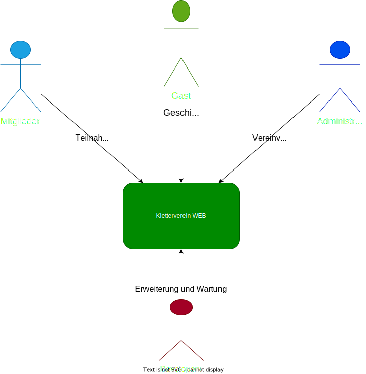

= Pflichtenheft
:project_name: Projektname
== __{project_name}__

[options="header"]
[cols="1, 1, 1, 1, 4"]
|===
|Version | Status      | Bearbeitungsdatum   | Autoren(en) |  Vermerk
|0.1     | In Arbeit   | 29.10.2023          | Autor       | Initiale Version
|===

:project_name: Kletterverein
:company_name: Der Dresdner Kletterverein

== Inhaltsverzeichnis
Dieses Dokument benötigt ein Inhaltsverzeichnis. Es existieren mehrere Einbindungsmöglichkeiten.

== Zusammenfassung
Eine kurze Beschreibung des Dokuments. Wenige Absätze.

== Aufgabenstellung und Zielsetzung
Text aus Aufgabenstellung kopieren und ggfs. präzisieren.
Insbesondere ergänzen, welche Ziele mit dem Abschluss des Projektes erreicht werden sollen.

== Produktnutzung
[In welchem Kontext soll das System später genutzt werden? Welche Rahmenbedingungen gelten? Zusätzlich kurze Einleitung für fachfremde Personen]
(1)Zielgruppe

- Gäste, die sich über den Verein informieren möchten oder Mitglied werden möchten
- Mitglieder des Klettervereins
- Mitarbeiter, die administrative Aufgaben übernehmen
- Ehrenamtliche,die im Verein tätig sind
- Geschäftsführung des Klettervereins
- Trainer, die die Klettergruppen leiten
- Shop-Verwalter, die den Vereinsshop verwalten
--> jede Altersgruppe, jeder soll sich angesprochen fühlen

(2) Betriebsbedingungen:

- zugänglich auf Desktop-Computern und mobilen Geräten
- System sollte in der Lage sein eine große Anzahl von Nutzern gleichzeitig zu unterstützen
- sollte in der Lage sein regelmäßige Updates und Wartungsarbeiten durchzuführen
- unterschiedliche Zugriffsrechte für die jeweilige Position im Unternehmen

(3)Verwendungsarten:

- Gäste nutzen das System, um sich über den Verein zu informieren, Produkte aus dem Shop zu kaufen, registrieren als Mitglied
- Mitglieder nutzen das System, um sich einzuloggen, ihre Daten zu verwalten, Produkte zu kaufen und sich über Vereinsnachrichten zu informieren
- Mitarbeiter nutzen das System, um Mitglieder zu verwalten, Nachrichten zu posten und ehrenamtliche Arbeit zu erfassen und auszuwerten
- Ehrenamtliche nutzen das System, um ihre ehrenamtliche Arbeit zu erfassen und Gegenstände auszuleihen
- Geschäftsführung nutzt das System, um Rechte und Zugriffe für verschiedene Nutzergruppen festzulegen
- Trainer nutzen das System, um Klettergruppen zu verwalten und Trainingsstunden zu erfassen
- Shop-Verwalter nutzen das System, um Produkte im Shop zu verwalten

(4) Einsatzbeschränkungen:

- das System sollte nur von autorisierten Nutzern verwendet werden können
- den Datenschutzbestimmungen entsprechen und personenbezogene Daten sicher speichern
- DAV-Identifikationsschema für die Mitgliederregistrierung und -verwaltung verwenden

==Interessensgruppen
1. Endbenutzer:
• Gäste
• Mitglieder: Registrierung, den Zugriff auf Vereinsnachrichten und den Kauf von Produkten
• Mitarbeiter: administrative Aufgaben
• Ehrenamtliche: Erfassungssystem für ehrenamtliche Arbeit, Ausleihsystem 
• Trainer: Verwaltung von Klettergruppen und die Erfassung von Trainingsstunden         
2. Geschäftsführung des Klettervereins: Auftragsgeber, haben Einfluss auf Budget, Zeitplan und Hauptfunktionalitäten
3. Shop-Verwalter: Sie haben spezifische Anforderungen an das Shop-System, z.B. Produktverwaltung, Bestandsführung und Verkaufsstatistiken
4. Externe Partner:
• DAV (Deutscher Alpenverein)
• Lieferanten: Für den Shop könnten Lieferanten spezifische Anforderungen an das Bestell- und Lagerverwaltungssystem haben
5. Finanziers oder Investoren:wenn das Projekt extrene Finanzierung erhält, können gewisse Anforderungen noch hinzu kommen
6. Öffentlichkeit und Medien

[[Stakeholders]]
== Stakeholders
Hier ist jede Gruppe oder Einzelperson (real oder juristisch) aufgeführt, die/der Einfluss auf die Anforderungen des Systems hat.
In der folgenden Tabelle sind diese Stakeholder aufgeführt und ihnen ist eine Priorität zugewiesen (falls Anforderungen kollidieren sollten, erleichtert dies die Entscheidungsfindung).
und ihre übergeordneten Ziele werden beschrieben.

Die zugewiesenen Prioritäten reichen von 1 (niedrigste Priorität) bis 5 (höchste Priorität).

[options="header", cols="2, ^1, 4, 4"]
|===
|Name
|Priorität (1..5)
|Beschreibung
|Ziele

|{company_name}
|5
|Der Hauptkunde dieses Projekts.
a|
- Digitale Transformation
- Effizienz und Zeitersparnis
- Einbindung eines jüngeren Publikums
- Zugang zu Informationen für Mitglieder und Gäste
- Merchandising-Verkauf

|Mitglieder
|4
|Hauptbenutzer der Anwendung. Nutzung der Website zur Optimierung der Mitgliedschaft im Kletterverein.
a|
- Teilnahme an Training und Veranstaltungen
- Einfache Kommunikation
- Zugriff auf den Shop
- Sicherheit und Datenschutz

|Administrators
|2
|Eine weitere wichtige Gruppe von Stakeholdern in diesem Projekt. Benutzer, die den Verein verwalten.
a|
- Effizienz in der Vereinsverwaltung
- Zeiteinsparungen bei Routineaufgaben
- Klar strukturierte Ehrenamtliche Arbeit
- Zeiterfassung und Abrechnung

|Developers
|3
|Personen, die entweder die Anwendung implementieren oder später für die Wartung verantwortlich sind.
a|
- Leicht erweiterbare Anwendung
- Geringer Wartungsaufwand
- Gute Debugging-Mechanismen

|===

== Systemgrenze und Top-Level-Architektur

=== Kontextdiagramm
Das Kontextdiagramm zeigt das geplante Software-System in seiner Umgebung. Zur Umgebung gehören alle Nutzergruppen des Systems und Nachbarsysteme. Die Grafik kann auch informell gehalten sein. Überlegen Sie sich dann geeignete Symbole. Die Grafik kann beispielsweise mit Visio erstellt werden. Wenn nötig, erläutern Sie diese Grafik.

[[kontext_diagram]]

=== Top-Level-Architektur
Die Top-Level-Architektur bietet eine Übersicht über die Hauptkomponenten und deren Interaktionen.

=== Komponenten:
    * Öffentliche Webseite
    * Mitglieder- und Person-Management
    * Online-Shop
    * System zur Verfolgung ehrenamtlicher Arbeit
    * System zur Ausleihe von Ausrüstung
    * Benutzerführung und Sicherheitskonformität

=== Interaktionen:
[[interaction_diagram]]
image::./models/interaktionen.svg[interaction diagram, 100%, 100%, pdfwidth=100%, title="Interaktionen Diagram", align=center]

== Anwendungsfälle

=== Akteure

Akteure sind die Benutzer des Software-Systems oder Nachbarsysteme, welche darauf zugreifen. Dokumentieren Sie die Akteure in einer Tabelle. Diese Tabelle gibt einen Überblick über die Akteure und beschreibt sie kurz. Die Tabelle hat also mindestens zwei Spalten (Akteur Name und Kommentar).
Weitere relevante Spalten können bei Bedarf ergänzt werden.

// See http://asciidoctor.org/docs/user-manual/#tables
[options="header"]
[cols="1,4"]
|===
|Name |Beschreibung
|...  |...
|===

=== Überblick Anwendungsfalldiagramm
Anwendungsfall-Diagramm, das alle Anwendungsfälle und alle Akteure darstellt

=== Anwendungsfallbeschreibungen
Dieser Unterabschnitt beschreibt die Anwendungsfälle. In dieser Beschreibung müssen noch nicht alle Sonderfälle und Varianten berücksichtigt werden. Schwerpunkt ist es, die wichtigsten Anwendungsfälle des Systems zu finden. Wichtig sind solche Anwendungsfälle, die für den Auftraggeber, den Nutzer den größten Nutzen bringen.
Für komplexere Anwendungsfälle ein UML-Sequenzdiagramm ergänzen.
Einfache Anwendungsfälle mit einem Absatz beschreiben.
Die typischen Anwendungsfälle (Anlegen, Ändern, Löschen) können zu einem einzigen zusammengefasst werden.

== Funktionale Anforderungen

=== Muss-Kriterien
Was das zu erstellende Programm auf alle Fälle leisten muss.

=== Kann-Kriterien
Anforderungen die das Programm leisten können soll, aber für den korrekten Betrieb entbehrlich sind.

== Nicht-Funktionale Anforderungen

=== Qualitätsziele

Dokumentieren Sie in einer Tabelle die Qualitätsziele, welche das System erreichen soll, sowie deren Priorität.

=== Konkrete Nicht-Funktionale Anforderungen

Beschreiben Sie Nicht-Funktionale Anforderungen, welche dazu dienen, die zuvor definierten Qualitätsziele zu erreichen.
Achten Sie darauf, dass deren Erfüllung (mindestens theoretisch) messbar sein muss.

== GUI Prototyp

In diesem Kapitel soll ein Entwurf der Navigationsmöglichkeiten und Dialoge des Systems erstellt werden.
Idealerweise entsteht auch ein grafischer Prototyp, welcher dem Kunden zeigt, wie sein System visuell umgesetzt werden soll.
Konkrete Absprachen - beispielsweise ob der grafische Prototyp oder die Dialoglandkarte höhere Priorität hat - sind mit dem Kunden zu treffen.

=== Überblick: Dialoglandkarte
Erstellen Sie ein Übersichtsdiagramm, das das Zusammenspiel Ihrer Masken zur Laufzeit darstellt. Also mit welchen Aktionen zwischen den Masken navigiert wird.
//Die nachfolgende Abbildung zeigt eine an die Pinnwand gezeichnete Dialoglandkarte. Ihre Karte sollte zusätzlich die Buttons/Funktionen darstellen, mit deren Hilfe Sie zwischen den Masken navigieren.

=== Dialogbeschreibung
Für jeden Dialog:

1. Kurze textuelle Dialogbeschreibung eingefügt: Was soll der jeweilige Dialog? Was kann man damit tun? Überblick?
2. Maskenentwürfe (Screenshot, Mockup)
3. Maskenelemente (Ein/Ausgabefelder, Aktionen wie Buttons, Listen, …)
4. Evtl. Maskendetails, spezielle Widgets

== Datenmodell

=== Überblick: Klassendiagramm
UML-Analyseklassendiagramm

=== Klassen und Enumerationen
Dieser Abschnitt stellt eine Vereinigung von Glossar und der Beschreibung von Klassen/Enumerationen dar. Jede Klasse und Enumeration wird in Form eines Glossars textuell beschrieben. Zusätzlich werden eventuellen Konsistenz- und Formatierungsregeln aufgeführt.

// See http://asciidoctor.org/docs/user-manual/#tables
[options="header"]
|===
|Klasse/Enumeration |Beschreibung |
|…                  |…            |
|===

== Akzeptanztestfälle
Mithilfe von Akzeptanztests wird geprüft, ob die Software die funktionalen Erwartungen und Anforderungen im Gebrauch erfüllt. Diese sollen und können aus den Anwendungsfallbeschreibungen und den UML-Sequenzdiagrammen abgeleitet werden. D.h., pro (komplexen) Anwendungsfall gibt es typischerweise mindestens ein Sequenzdiagramm (welches ein Szenarium beschreibt). Für jedes Szenarium sollte es einen Akzeptanztestfall geben. Listen Sie alle Akzeptanztestfälle in tabellarischer Form auf.
Jeder Testfall soll mit einer ID versehen werde, um später zwischen den Dokumenten (z.B. im Test-Plan) referenzieren zu können.

== Glossar
Sämtliche Begriffe, die innerhalb des Projektes verwendet werden und deren gemeinsames Verständnis aller beteiligten Stakeholder essentiell ist, sollten hier aufgeführt werden.
Insbesondere Begriffe der zu implementierenden Domäne wurden bereits beschrieben, jedoch gibt es meist mehr Begriffe, die einer Beschreibung bedürfen. +
Beispiel: Was bedeutet "Kunde"? Ein Nutzer des Systems? Der Kunde des Projektes (Auftraggeber)?

== Offene Punkte
Offene Punkte werden entweder direkt in der Spezifikation notiert. Wenn das Pflichtenheft zum finalen Review vorgelegt wird, sollte es keine offenen Punkte mehr geben.
