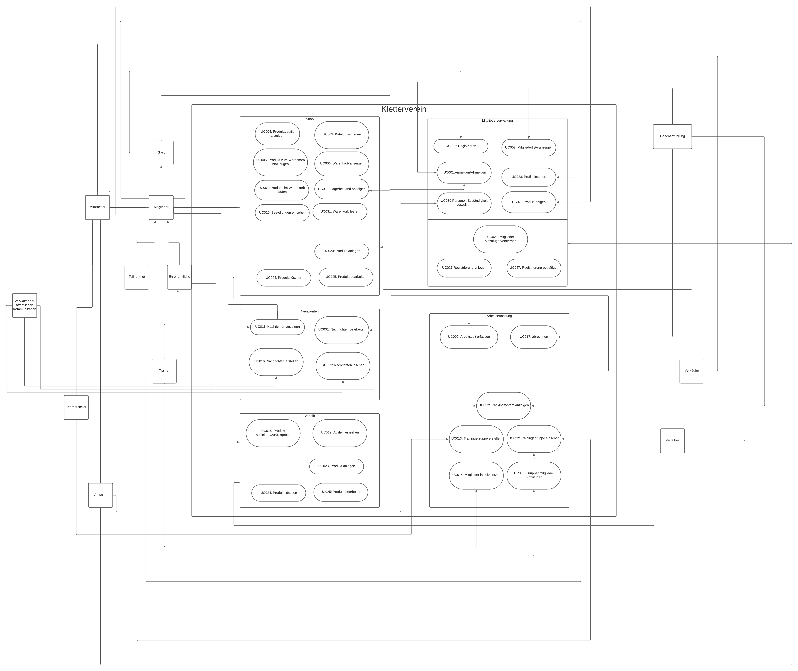
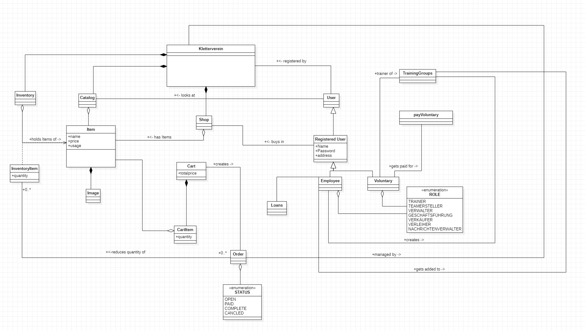

= Pflichtenheft
:project_name: Projektname
== __{project_name}__

[options="header"]
[cols="1, 1, 1, 1, 4"]
|===
|Version | Status      | Bearbeitungsdatum   | Autoren(en) |  Vermerk
|0.1     | In Arbeit   | 29.10.2023          | Autor       | Initiale Version
|===

:project_name: Kletterverein
:company_name: Der Dresdner Kletterverein

== Inhaltsverzeichnis
Dieses Dokument benötigt ein Inhaltsverzeichnis. Es existieren mehrere Einbindungsmöglichkeiten.

== Zusammenfassung
Dieses Dokument stellt das Pflichtenheft des Projekts Klettervereinswebsite dar. Es soll einen Überblick über das zu erstellende Softwareprodukt geben und dient als Grundlage für die Kommunikation zwischen den Projektbeteiligten, hauptsächlich dem Kunden und dem Entwicklungsteam. Dieses Dokument soll als Grundlage für einen Vertrag zwischen Auftraggeber und Auftragnehmer dienen. Auftraggeber und Auftragnehmer und sollte daher validiert und auf Konsistenz geprüft werden. Das Pflichtenheft beschreibt, was das gewünschte System zu erfüllen hat und teilweise, wie der Auftragnehmer die Lösung zu implementieren gedenkt.

Im Allgemeinen sollte das Pflichtenheft korrekt, vollständig und konsistent sein. Da sie am Ende des Projekts verwendet wird, um zu überprüfen, ob die definierte Software geliefert wurde oder nicht, sollte dieses Ziel überprüfbar sein. Es wird während des gesamten Projekts verwendet und konsultiert, weshalb der Inhalt in allen erstellten Artefakten nachvollziehbar sein sollte. In Verbindung mit dem oben Gesagten ist es wünschenswert, dass es einfach zu ändern und weiterzuentwickeln ist, auch wenn die Änderungen auf ein Minimum beschränkt werden sollten, nachdem sich die Beteiligten einmal auf den Inhalt geeinigt haben. Da sich jedoch die Anforderungen und Umstände während eines Projekts ständig ändern, sind Anpassungen zu erwarten und müssen dokumentiert werden.

== Aufgabenstellung und Zielsetzung
Der Dresdner Kletterverein möchte sich der digitalen Wende stellen und seine analogen Verfahren digitalisieren. Dadurch erhofft er sich zeitliche Ersparnisse sowie eine bessere Anknüpfung an die jungen Leute. Der Verein hat sich folgende Schwerpunkte überlegt, die er gerne als Erstes angehen möchte. 
Der Verein wünscht sich eine Webseite, die alle Gäste nutzen können und verschiedene Informationen zeigt. Ganz wichtig ist dabei, dass Gäste sowie Mitglieder über neuste Nachrichten aus dem Vereinsleben informiert werden oder sich informieren können. Dazu gehören vor allem über Brand- und Brutschutz. Weiterhin möchte sich der Verein neuen möglichen Mitglieder durch ein ansprechendes Design modern und fortschrittlich vorstellen.  Fokus soll dabei auf der Entstehungsgeschichte des Vereines sowie den aktuellen Entwicklungen liegen.

Im Allgemeinen sollen alle Systeme durch verschiedene Nutzergruppen genutzt werden. Bei einer Analyse wurden die folgenden allgemeinen Gruppen gefunden: Mitarbeiter, Mitglieder und Ehrenamtlichen. Eine Person kann dabei auch mehr Rollen zugleich besitzen, da Ehrenamtliche zugleich immer auch Mitglieder sind. Wichtig ist jedoch, dass jeder nur die Rechte besitzt und auf die Seiten zugreifen kann, die durch die Geschäftsführung festgelegt wurden. Um alle Personen des Vereines zu managen, wünscht sich der Verein eine Person- und Mitgliederverwaltung. Dabei sollen neue Personen und Mitglieder angelegt, bearbeitet und gelöscht werden können. Es ist es sehr wichtig, dass dieser Überblick klar strukturiert ist und die wichtigen Informationen bereitstellt, da häufig neue Anträge gestellt werden. Für die einfache Interaktion zwischen Mitgliedern und den Mitarbeitern kann sich jedes Mitglied online registrieren, wobei hierzu eine Mitgliedsnummer nötig ist. Danach muss das Mitglied von einer berechtigten Person freigeschaltet werden, bevor es als aktiv zählt. Derzeitig wird das DAV (Deutscher Alpenvereins) Identifikationsschema genutzt und soll weiterhin angewendet werden. 

Neben der Verwaltung der Mitglieder und Nutzer hat der Verein einen Shop in dem er verschiedenes verkauft. Darunter fallen zum Beispiel T-Shirt, Pullover und Jacken mit dem Logo des Vereines sowie wichtiges Kletterequipment für die Halle und draußen.Der Shop soll nur von Mitgliedern einsehbar sein. Dabei soll Bezahlung sowie über das in der Mitgliedschaft hinterlegte Konto als auch bar vor Ort möglich sein.

Neben den normalen Systemen eines Vereines wie der Shop benötigt der Kletterverein eine zusätzliche zugeschnittene Softwarekomponente. Diese soll die vollbrachte ehrenamtlicher Arbeit der Ehrenamtlichen Mitarbeiter erfassen und auswerten. Mittels einer Entschädigung soll für Engagement im Verein jeder belohnt werden. Das System soll dabei folgende Funktionen besitzen. Eine zuständige Person der Mitarbeiter kann Klettergruppen anlegen, die Teilnehmer und
Trainer beinhaltet. Dabei muss deine neu angelegte Klettergruppe bereits einen festgelegten Trainer haben. Dieser kann, nachdem die Gruppe angelegt wurde Teilnehmer hinzufügen oder als inaktiv setzen. Teilnehmer können den Trainer per Mail kontaktieren, um sich für die Gruppe anzumelden. Teilnehmer und Trainer sind dabei ausschließlich Mitglieder des Vereines. Ist eine Trainingsstunde abgehalten worden, kann der Trainer diese in einem Art Trackingsystem eintragen. Erfasst werden soll dabei: Datum, Ort, Anfangs- und Endzeit und wer alles anwesend war. Alles soll sehr übersichtlich und strukturiert sein, da die Altersspanne der Personen sehr
groß ist, die mit diesem System arbeiten müssen. Im Rhythmus von 1/2 Jahr werden dann die Unterrichtsstunden zusammengerechnet und abgerechnet. Die erfassten Daten sollen jedoch von der Geschäftsführung jederzeit einschtbar sein.

Besonders an dem Kletterverein ist der Verleih für seine ehrenamtlichen Mitarbeiter. Diese können verschiedene Dinge für eine bestimmte Zeit ausleihen. Pro Element gibt es eine Historie wer es wann ausgeliehen hatte, sowie wann es zurückgegeben wurde. Für das Ausleihen ist nur die Mitgliedsnummer bei der Abholung notwendig.

Damit sich die Nutzer gut in der online Anwendung zurechtfinden, soll es Hilfestellungen und Hinweise zu den Eingaben geben. Zudem müssen bestimmte Sicherheitsvorschriften, die vom Staat vorgegeben wurden, erfüllen werden. Dazu gehören die Passwortstärke und die Speicherung von Passwörtern in der Form eines Hashes. Eine mögliche Ergänzung wäre eine text-to-speech Funkion.

== Produktnutzung
[In welchem Kontext soll das System später genutzt werden? Welche Rahmenbedingungen gelten? Zusätzlich kurze Einleitung für fachfremde Personen]
(1)Zielgruppe

- Gäste, die sich über den Verein informieren möchten oder Mitglied werden möchten
- Mitglieder des Klettervereins
- Mitarbeiter, die administrative Aufgaben übernehmen
- Ehrenamtliche,die im Verein tätig sind
- Geschäftsführung des Klettervereins
- Trainer, die die Klettergruppen leiten
- Shop-Verwalter, die den Vereinsshop verwalten
--> jede Altersgruppe, jeder soll sich angesprochen fühlen

(2) Betriebsbedingungen:

- zugänglich auf Desktop-Computern und mobilen Geräten
- System sollte in der Lage sein eine große Anzahl von Nutzern gleichzeitig zu unterstützen
- sollte in der Lage sein regelmäßige Updates und Wartungsarbeiten durchzuführen
- unterschiedliche Zugriffsrechte für die jeweilige Position im Unternehmen

(3)Verwendungsarten:

- Gäste nutzen das System, um sich über den Verein zu informieren, Produkte aus dem Shop zu kaufen, registrieren als Mitglied
- Mitglieder nutzen das System, um sich einzuloggen, ihre Daten zu verwalten, Produkte zu kaufen und sich über Vereinsnachrichten zu informieren
- Mitarbeiter nutzen das System, um Mitglieder zu verwalten, Nachrichten zu posten und ehrenamtliche Arbeit zu erfassen und auszuwerten
- Ehrenamtliche nutzen das System, um ihre ehrenamtliche Arbeit zu erfassen und Gegenstände auszuleihen
- Geschäftsführung nutzt das System, um Rechte und Zugriffe für verschiedene Nutzergruppen festzulegen
- Trainer nutzen das System, um Klettergruppen zu verwalten und Trainingsstunden zu erfassen
- Shop-Verwalter nutzen das System, um Produkte im Shop zu verwalten

(4) Einsatzbeschränkungen:

- das System sollte nur von autorisierten Nutzern verwendet werden können
- den Datenschutzbestimmungen entsprechen und personenbezogene Daten sicher speichern
- DAV-Identifikationsschema für die Mitgliederregistrierung und -verwaltung verwenden

== Interessensgruppen

1. Endbenutzer:

• Gäste
• Mitglieder: Registrierung, den Zugriff auf Vereinsnachrichten und den Kauf von Produkten
• Mitarbeiter: administrative Aufgaben
• Ehrenamtliche: Erfassungssystem für ehrenamtliche Arbeit, Ausleihsystem 
• Trainer: Verwaltung von Klettergruppen und die Erfassung von Trainingsstunden 

2. Geschäftsführung des Klettervereins: Auftragsgeber, haben Einfluss auf Budget, Zeitplan und Hauptfunktionalitäten

3. Shop-Verwalter: Sie haben spezifische Anforderungen an das Shop-System, z.B. Produktverwaltung, Bestandsführung und Verkaufsstatistiken

4. Externe Partner:

• DAV (Deutscher Alpenverein)
• Lieferanten: Für den Shop könnten Lieferanten spezifische Anforderungen an das Bestell- und Lagerverwaltungssystem haben

5. Finanziers oder Investoren:wenn das Projekt extrene Finanzierung erhält, können gewisse Anforderungen noch hinzu kommen

6. Öffentlichkeit und Medien

[[Stakeholders]]
== Stakeholders
Hier ist jede Gruppe oder Einzelperson (real oder juristisch) aufgeführt, die/der Einfluss auf die Anforderungen des Systems hat.
In der folgenden Tabelle sind diese Stakeholder aufgeführt und ihnen ist eine Priorität zugewiesen (falls Anforderungen kollidieren sollten, erleichtert dies die Entscheidungsfindung).
und ihre übergeordneten Ziele werden beschrieben.

Die zugewiesenen Prioritäten reichen von 1 (niedrigste Priorität) bis 5 (höchste Priorität).

[options="header", cols="2, ^1, 4, 4"]
|===
|Name
|Priorität (1..5)
|Beschreibung
|Ziele

|{company_name}
|5
|Der Hauptkunde dieses Projekts.
a|
- Digitale Transformation
- Effizienz und Zeitersparnis
- Einbindung eines jüngeren Publikums
- Zugang zu Informationen für Mitglieder und Gäste
- Merchandising-Verkauf

|Mitglieder
|4
|Hauptbenutzer der Anwendung. Nutzung der Website zur Optimierung der Mitgliedschaft im Kletterverein.
a|
- Teilnahme an Training und Veranstaltungen
- Einfache Kommunikation
- Zugriff auf den Shop
- Sicherheit und Datenschutz

|Administrators
|2
|Eine weitere wichtige Gruppe von Stakeholdern in diesem Projekt. Benutzer, die den Verein verwalten.
a|
- Effizienz in der Vereinsverwaltung
- Zeiteinsparungen bei Routineaufgaben
- Klar strukturierte Ehrenamtliche Arbeit
- Zeiterfassung und Abrechnung

|Developers
|3
|Personen, die entweder die Anwendung implementieren oder später für die Wartung verantwortlich sind.
a|
- Leicht erweiterbare Anwendung
- Geringer Wartungsaufwand
- Gute Debugging-Mechanismen

|===

== Systemgrenze und Top-Level-Architektur

=== Kontextdiagramm
Das Kontextdiagramm zeigt das geplante Software-System in seiner Umgebung. Zur Umgebung gehören alle Nutzergruppen des Systems und Nachbarsysteme. Die Grafik kann auch informell gehalten sein. Überlegen Sie sich dann geeignete Symbole. Die Grafik kann beispielsweise mit Visio erstellt werden. Wenn nötig, erläutern Sie diese Grafik.

[[kontext_diagram]]
image::./models/Kontext.png[kontext diagram, 100%, 100%, pdfwidth=100%, title="Kontext Diagram", align=center]

=== Top-Level-Architektur
Die Top-Level-Architektur bietet eine Übersicht über die Hauptkomponenten und deren Interaktionen.

[[top-level_diagram]]
image::./models/TopLevel.png[top-level diagram, 100%, 100%, pdfwidth=100%, title="Top-Level-Diagramm", align=center]

=== Komponenten:
    * Öffentliche Webseite
    * Mitglieder- und Person-Management
    * Online-Shop
    * System zur Verfolgung ehrenamtlicher Arbeit
    * System zur Ausleihe von Ausrüstung

=== Interaktionen:
[[interaction_diagram]]
image::./models/interaktionen.svg[interaction diagram, 100%, 100%, pdfwidth=100%, title="Interaktionen Diagram", align=center]

== Anwendungsfälle

[cols="2*", options="header"]
|===
| Name            | Beschreibung
| Gast            | Jemand, der die Webseite besucht, ohne sich anzumelden.
| Mitglied        | Ein registrierter Benutzer des Vereins, der Mitgliedschaftsrechte besitzt.
| Mitarbeiter     | Ein Angestellter des Vereins, der administrative Aufgaben durchführt.
| Trainer         | Ein Mitglied, das Trainingsgruppen leitet und Trainingsdaten im System erfasst.
| Ehrenamtliche   | Mitglieder, die freiwillige Dienste für den Verein leisten.
| Geschäftsführung| Personen, die die höchsten Entscheidungsbefugnisse im Verein haben und strategische Entscheidungen treffen.
| Teamersteller   | Ein Mitglied oder Mitarbeiter, der berechtigt ist, neue Teams oder Gruppen im System zu erstellen.
| Verwalter       | Ein Mitglied oder Mitarbeiter, der berechtigt ist, Systemdaten und -einstellungen zu verwalten.
| Verwalter d.ö.K | Ein Mitglied oder Mitarbeiter, der berechtigt ist, die öffentliche Kommunikation zu verwalten.
|===

=== Überblick Anwendungsfalldiagramm
Anwendungsfall-Diagramm, das alle Anwendungsfälle und alle Akteure darstellt

[[use-case_diagram]]

== Anwendungsfallbeschreibungen

[cols="1h,3"]
[[UC001]]
|===
|ID                         |**<<UC001>>**
|Name                       |Anmelden/Abmelden
|Beschreibung               |Ein Benutzer soll sich im System anmelden können, um weitere Funktionen zu nutzen. Dieser Prozess soll durch Abmeldung umkehrbar sein.
|Akteure                    |Mitglied
|Auslöser                   |Benutzer wählt "Anmelden" in der Navigationsleiste
|Vorbedingung(en)          a|
- Anmeldung: Benutzer ist noch nicht authentifiziert.
- Abmeldung: Benutzer ist authentifiziert.
|Hauptschritte             a|
1. Benutzer wählt "Anmelden" in der Navigationsleiste.
2. Benutzer gibt seine Anmeldedaten ein.
3. Benutzer klickt auf "Anmelden"-Button.
4. Benutzer wählt "Abmelden" in der Navigationsleiste.
5. Benutzer wird abgemeldet und zur Startseite weitergeleitet.
|Erweiterungen              |-
|Funktionale Anforderungen  | <<F0010>>
|===

[cols="1h,3"]
[[UC002]]
|===
|ID                         |**<<UC002>>**
|Name                       |Registrieren
|Beschreibung               |Ein nicht authentifizierter Benutzer soll ein Konto für sich selbst erstellen können.
|Akteure                    |Gast
|Auslöser                   |Benutzer wählt "Registrieren" in der Navigationsleiste
|Vorbedingung(en)          a|
- Benutzer ist nicht authentifiziert.
|Hauptschritte             a|
1. Benutzer wählt "Registrieren" in der Navigationsleiste.
2. Benutzer gibt gewünschten Benutzernamen, Passwort und andere notwendige Informationen ein.
3. System überprüft die Einzigartigkeit des Benutzernamens.
4. Bei Einzigartigkeit wird ein Konto mit den angegebenen Daten erstellt.
|Erweiterungen              |-
|Funktionale Anforderungen  | <<F0020>>
|===

[cols="1h,3"]
[[UC003]]
|===
|ID                         |**<<UC003>>**
|Name                       |Katalog anzeigen
|Beschreibung               |Jeder Besucher des Shops soll auf den Katalog zugreifen können, der alle angebotenen Produkte anzeigt.
|Akteure                    |Mitglied
|Auslöser                   |Benutzer klickt auf das Navigationselement "Katalog"
|Hauptschritte             a|
1. Benutzer klickt auf das Navigationselement "Katalog".
2. Benutzer sieht alle Produkte der ausgewählten Kategorie.
|Erweiterungen              |-
|Funktionale Anforderungen  | <<F0030>>
|===

[cols="1h,3"]
[[UC004]]
|===
|ID                         |**<<UC004>>**
|Name                       |Produktdetails anzeigen
|Beschreibung               |Ein Benutzer soll die Details eines Produkts auf einer extra Seite einsehen können.
|Akteure                    |Mitglied
|Auslöser                   |Benutzer klickt auf einen im Katalog angezeigten Eintrag
|Vorbedingung(en)          a|
- Benutzer betrachtet den Katalog.
|Hauptschritte             a|
1. Benutzer klickt auf einen im Katalog angezeigten Eintrag.
2. Benutzer sieht die Details des ausgewählten Produkts.
|Erweiterungen              |-
|Funktionale Anforderungen  | <<F0040>>
|===

[cols="1h,3"]
[[UC005]]
|===
|ID                         |**<<UC005>>**
|Name                       |Produkt zum Warenkorb hinzufügen
|Beschreibung               |Ein registrierter Benutzer soll ein Produkt in gewünschter Menge seinem Warenkorb hinzufügen können.
|Akteure                    |Mitglied
|Auslöser                   |Benutzer betrachtet die Produktdetailseite
|Vorbedingung(en)          a|
- Benutzer ist authentifiziert.
|Hauptschritte             a|
1. Benutzer gibt die gewünschte Menge für das ausgewählte Produkt ein.
2. Benutzer klickt auf "Zum Warenkorb hinzufügen".
3. Produkt wird mit der ausgewählten Menge seinem Warenkorb hinzugefügt.
|Erweiterungen              |-
|Funktionale Anforderungen  | <<F0050>>
|===

[cols="1h,3"]
[[UC006]]
|===
|ID                         |**<<UC006>>**
|Name                       |Warenkorb anzeigen
|Beschreibung               |Ein registrierter Benutzer soll den Inhalt seines Warenkorbs und den Gesamtpreis seiner Auswahl einsehen können.
|Akteure                    |Mitglied
|Auslöser                   |Benutzer klickt auf "Warenkorb" in der Navigationsleiste
|Vorbedingung(en)          a|
- Benutzer ist authentifiziert.
|Hauptschritte             a|
1. Benutzer klickt auf "Warenkorb" in der Navigationsleiste.
2. Benutzer sieht den Inhalt seines Warenkorbs und den Gesamtpreis.
|Erweiterungen              |-
|Funktionale Anforderungen  | <<F0051>>
|===

[cols="1h,3"]
[[UC007]]
|===
|ID                         |**<<UC007>>**
|Name                       |Produkte im Warenkorb kaufen
|Beschreibung               |Ein Mitglied soll den Inhalt seines Warenkorbs kaufen können.
|Akteure                    |Mitglied
|Auslöser                   |Mitglied klickt auf "Kaufen"
|Vorbedingung(en)          a|
- Mitglied ist authentifiziert und hat Produkte im Warenkorb.
|Hauptschritte             a|
1. Mitglied klickt auf "Kaufen".
2. Bestellung wird gegen Lagerbestand geprüft.
3. Bestellung wird automatisch bezahlt.
4. Produkte werden in der gewählten Menge aus dem Lager entfernt.
5. Bestellung wird archiviert.
|Erweiterungen              |-
|Funktionale Anforderungen  | <<F0052>>
|===

[cols="1h,3"]
[[UC008]]
|===
|ID                         |**<<UC008>>**
|Name                       |Mitgliederliste anzeigen
|Beschreibung               |Ein Mitarbeiter oder Mitglied der Geschäftsführung sollte in der Lage sein, die gesamte Liste der Kunden der Anwendung einzusehen.
|Akteure                    |Geschäftsführung
|Auslöser                   |Benutzer wählt "Mitglieder" in der Navigationsleiste
|Vorbedingung(en)          a|
- Benutzer ist authentifiziert und hat die Rolle "Mitarbeiter" oder "Geschäftsführung".
|Hauptschritte             a|
1. Benutzer wählt "Kunden" in der Navigationsleiste.
2. Die komplette Liste aller registrierten Benutzer mit der Rolle "Kunde" wird angezeigt.
|Erweiterungen              |-
|Funktionale Anforderungen  | <<F0060>>
|===

[cols="1h,3"]
[[UC009]]
|===
|ID                         |**<<UC009>>**
|Name                       |Arbeitszeit erfassen
|Beschreibung               |Mitarbeiter und Ehrenamtliche sollten in der Lage sein, ihre Arbeitszeit in der Anwendung separat zu erfassen.
|Akteure                    |Mitarbeiter, Ehrenamtliche
|Auslöser                   |Ein Benutzer möchte seine Arbeitszeit erfassen.
|Vorbedingung(en)          a|
- Der Benutzer ist authentifiziert und angemeldet.
|Hauptschritte             a|
1. Der Benutzer, sei es ein Mitarbeiter oder ein Ehrenamtlicher, wählt die Option "Arbeitszeit erfassen" in der Anwendung aus.
2. Die Anwendung öffnet ein Formular zur Erfassung der Arbeitszeit.
3. Der Benutzer gibt das Datum, die Arbeitszeit (Anfangs- und Endzeit) und gegebenenfalls Bemerkungen ein.
4. Der Benutzer klickt auf "Speichern" oder "Absenden", um die erfasste Arbeitszeit zu bestätigen.
|Erweiterungen              |-
|Funktionale Anforderungen  | <<F0070>> (für Mitarbeiter), <<F0071>> (für Ehrenamtliche)
|===

[cols="1h,3"]
[[UC010]]
|===
|ID                         |**<<UC010>>**
|Name                       |Lagerbestand anzeigen
|Beschreibung               |Ein Verkäufer sollte in der Lage sein, das Inventar einschließlich des aktuellen Lagerbestands einzusehen.
|Akteure                    |Verkäufer
|Auslöser                   |Benutzer wählt "Lager" in der Navigationsleiste
|Vorbedingung(en)          a|
- Benutzer ist authentifiziert und hat die Rolle "Verkäufer".
|Hauptschritte             a|
1. Benutzer wählt "Lager" in der Navigationsleiste.
2. Die komplette Liste aller Artikel des Inventars und der aktuelle Lagerbestand wird angezeigt.
|Funktionale Anforderungen  | <<F0080>>
|===

[cols="1h,3"]
[[UC011]]
|===
|ID                         |**<<UC011>>**
|Name                       |Nachrichten anzeigen
|Beschreibung               |Mitglieder können aktuelle Nachrichten und Informationen über den Verein einsehen.
|Akteure                    |Mitglied, Gast
|Auslöser                   |Mitglied oder Gast besucht die Webseite
|Hauptschritte             a|
1. Mitglied/Gast besucht die Webseite.
2. Mitglied/Gast sieht die aktuellen Nachrichten und Informationen.
|Erweiterungen              |-
|Funktionale Anforderungen  | <<F0090>>
|===

[cols="1h,3"]
[[UC012]]
|===
|ID                         |**<<UC012>>**
|Name                       |Trackingsystem anzeigen
|Beschreibung               |Ehrenamtliche und Mitarbeiter können Trainingsstunden und Anwesenheit im Trackingsystem eintragen.
|Akteure                    |Ehrenamtliche, Mitarbeiter
|Auslöser                   |Benutzer wählt "Trackingsystem" im System
|Vorbedingung(en)          a|
- Benutzer ist authentifiziert.
|Hauptschritte             a|
1. Benutzer wählt "Trackingsystem" im System.
2. Benutzer trägt Datum, Ort, Anfangs- und Endzeit sowie die Anwesenheit der Teilnehmer ein.
|Erweiterungen              |-
|Funktionale Anforderungen  | <<F0100>>
|===

[cols="1h,3"]
[[UC013]]
|===
|ID                         |**<<UC013>>**
|Name                       |Trainingsgruppen erstellen
|Beschreibung               |Teamersteller können Trainingsgruppen erstellen.
|Akteure                    |Teamersteller
|Auslöser                   |Benutzer wählt "Trainingsgruppen erstellen" im System
|Vorbedingung(en)          a|
- Benutzer ist authentifiziert und hat die Rolle "Teamersteller".
|Hauptschritte             a|
1. Benutzer wählt "Trainingsgruppen erstellen" im System.
2. Benutzer gibt die notwendigen Informationen für die neue Trainingsgruppe ein.
3. Benutzer bestätigt die Erstellung der Trainingsgruppe.
|Erweiterungen              |-
|Funktionale Anforderungen  | <<F0110>>
|===

[cols="1h,3"]
[[UC014]]
|===
|ID                         |**<<UC014>>**
|Name                       |Mitglieder inaktiv setzen
|Beschreibung               |Trainer können Mitglieder in einer Trainingsgruppe als inaktiv setzen.
|Akteure                    |Trainer
|Auslöser                   |Trainer wählt die entsprechende Trainingsgruppe im System
|Vorbedingung(en)          a|
- Trainer ist authentifiziert.
|Hauptschritte             a|
1. Trainer wählt die entsprechende Trainingsgruppe im System.
2. Trainer setzt das betreffende Mitglied als inaktiv.
|Erweiterungen              |-
|Funktionale Anforderungen  | <<F0120>>
|===

[cols="1h,3"]
[[UC015]]
|===
|ID                         |**<<UC015>>**
|Name                       |Gruppenmitglieder hinzufügen
|Beschreibung               |Trainer können Mitglieder zu einer Trainingsgruppe hinzufügen.
|Akteure                    |Trainer
|Auslöser                   |Benutzer wählt die entsprechende Trainingsgruppe im System
|Vorbedingung(en)          a|
- Benutzer ist authentifiziert und hat die Rolle "Trainer".
|Hauptschritte             a|
1. Benutzer wählt die entsprechende Trainingsgruppe im System.
2. Benutzer fügt das neue Mitglied zur Gruppe hinzu.
|Erweiterungen              |-
|Funktionale Anforderungen  | <<F0121>>
|===

[cols="1h,3"]
[[UC016]]
|===
|ID                         |**<<UC016>>**
|Name                       |Nachrichten erstellen
|Beschreibung               |Benutzer sollte in der Lage sein, eine neue Nachricht in der Anwendung zu erstellen und an andere Benutzer zu senden.
|Akteure                    |Verwalter der öffentlichen Kommunikation
|Auslöser                   |Benutzer möchte eine neue Nachricht erstellen
|Vorbedingung(en)          a|
- Benutzer ist authentifiziert und angemeldet.
|Hauptschritte             a|
1. Benutzer wählt die Option "Neue Nachricht erstellen" in der Anwendung aus.
2. Die Anwendung öffnet ein Nachrichtenformular.
3. Benutzer gibt den Empfänger, den Betreff und den Nachrichtentext ein.
4. Benutzer klickt auf "Nachricht senden".
5. Die Nachricht wird an den ausgewählten Empfänger gesendet und im Nachrichtenverlauf des Absenders gespeichert.
|Erweiterungen              |-
|Funktionale Anforderungen  | <<F0091>>
|===

[cols="1h,3"]
[[UC017]]
|===
|ID                         |**<<UC017>>**
|Name                       |Abrechnen
|Beschreibung               |Die Geschäftsführung sollte in der Lage sein, Abrechnungen für Mitarbeiter und Ehrenamtliche in der Anwendung durchzuführen.
|Akteure                    |Geschäftsführung
|Auslöser                   |Geschäftsführung möchte eine Abrechnung durchführen.
|Vorbedingung(en)          a|
- Die Geschäftsführung ist authentifiziert und angemeldet.
|Hauptschritte             a|
1. Die Geschäftsführung wählt die Option "Abrechnen" in der Anwendung aus.
2. Die Anwendung öffnet ein Abrechnungsformular.
3. Die Geschäftsführung wählt die zu abrechnenden Mitarbeiter oder Ehrenamtlichen aus und gibt die Abrechnungsdetails ein.
4. Die Geschäftsführung klickt auf "Abrechnung durchführen".
5. Die Abrechnung wird in den Konten der ausgewählten Mitarbeiter oder Ehrenamtlichen vermerkt, und die Buchhaltungsdaten werden aktualisiert.
|Erweiterungen              |-
|Funktionale Anforderungen  | <<F0240>>
|===

[cols="1h,3"]
[[UC018]]
|===
|ID                         |**<<UC018>>**
|Name                       |Produkte ausleihen/zurückgeben
|Beschreibung               |Ehrenamtliche sollten in der Lage sein, Produkte für Veranstaltungen oder andere Zwecke auszuleihen und sie nach Gebrauch zurückzugeben.
|Akteure                    |Ehrenamtliche
|Auslöser                   |Ehrenamtlicher möchte ein Produkt ausleihen oder ein zuvor ausgeliehenes Produkt zurückgeben.
|Vorbedingung(en)          a|
- Ehrenamtlicher ist authentifiziert.
- Das gewünschte Produkt ist verfügbar (für den Ausleihvorgang).
|Hauptschritte             a|
1. Ehrenamtlicher wählt die Option "Produkte ausleihen" im System.
2. Ehrenamtlicher sucht und wählt das gewünschte Produkt aus.
3. Ehrenamtlicher bestätigt den Ausleihvorgang.
4. Bei Rückgabe wählt der Ehrenamtliche die Option "Produkte zurückgeben".
5. Ehrenamtlicher wählt das zurückzugebende Produkt aus und bestätigt die Rückgabe.
|Erweiterungen              |-
|Funktionale Anforderungen  | <<F0160>> (für Ausleihen), <<F0161>> (für Zurückgeben)
|===

[cols="1h,3"]
[[UC019]]
|===
|ID                         |**<<UC019>>**
|Name                       |Ausleihe einsehen
|Beschreibung               |Die Geschäftsführung sollte in der Lage sein, alle ausgeliehenen Produkte, die dazugehörigen Zeiträume und die verantwortlichen Ehrenamtlichen einzusehen.
|Akteure                    |Geschäftsführung
|Auslöser                   |Geschäftsführung möchte einen Überblick über alle ausgeliehenen Produkte erhalten.
|Vorbedingung(en)          a|
- Geschäftsführung ist authentifiziert.
|Hauptschritte             a|
1. Geschäftsführung wählt die Option "Ausleihe einsehen" im System.
2. Das System zeigt eine Liste aller ausgeliehenen Produkte, die dazugehörigen Zeiträume und die verantwortlichen Ehrenamtlichen.
|Erweiterungen              |-
|Funktionale Anforderungen  | <<F0162>>
|===

[cols="1h,3"]
[[UC020]]
|===
|ID                         |**<<UC020>>**
|Name                       |Bestellung einsehen
|Beschreibung               |Die Geschäftsführung sollte in der Lage sein, alle getätigten Bestellungen, die dazugehörigen Produkte, Mengen und Kundeninformationen einzusehen.
|Akteure                    |Geschäftsführung
|Auslöser                   |Geschäftsführung möchte einen Überblick über alle getätigten Bestellungen erhalten.
|Vorbedingung(en)          a|
- Geschäftsführung ist authentifiziert.
|Hauptschritte             a|
1. Geschäftsführung wählt die Option "Bestellung einsehen" im System.
2. Das System zeigt eine Liste aller getätigten Bestellungen, die dazugehörigen Produkte, Mengen und Kundeninformationen.
|Erweiterungen              |-
|Funktionale Anforderungen  | <<F0163>>
|===

[cols="1h,3"]
[[UC021]]
|===
|ID                         |**<<UC021>>**
|Name                       |Mitglieder hinzufügen/entfernen
|Beschreibung               |Ein Verwalter sollte in der Lage sein, Mitglieder zum System hinzuzufügen oder bestehende Mitglieder aus dem System zu entfernen.
|Akteure                    |Verwalter
|Auslöser                   |Verwalter möchte ein Mitglied hinzufügen oder entfernen.
|Vorbedingung(en)          a|
- Verwalter ist authentifiziert.
|Hauptschritte             a|
1. Verwalter wählt die Option "Mitglieder verwalten" im System.
2. Verwalter kann entweder ein neues Mitglied hinzufügen, indem er die notwendigen Informationen eingibt, oder ein bestehendes Mitglied auswählen und es entfernen.
|Erweiterungen              |-
|Funktionale Anforderungen  | <<F0164>>
|===

[cols="1h,3"]
[[UC022]]
|===
|ID                         |**<<UC022>>**
|Name                       |Trainingsgruppe einsehen
|Beschreibung               |Ein Teilnehmer sollte in der Lage sein, die Details einer Trainingsgruppe, der er angehört, einzusehen.
|Akteure                    |Teilnehmer
|Auslöser                   |Teilnehmer möchte Details seiner Trainingsgruppe sehen.
|Vorbedingung(en)          a|
- Teilnehmer ist authentifiziert und gehört mindestens einer Trainingsgruppe an.
|Hauptschritte             a|
1. Teilnehmer wählt die Option "Meine Trainingsgruppen" im System.
2. Das System zeigt die Details der Trainingsgruppe, einschließlich Trainer, Ort, Zeit und andere Mitglieder.
|Erweiterungen              |-
|Funktionale Anforderungen  | <<F0165>>
|===

[cols="1h,3"]
[[UC023]]
|===
|ID                         |**<<UC023>>**
|Name                       |Produkt anlegen
|Beschreibung               |Ein Verwalter sollte in der Lage sein, ein neues Produkt zum System hinzuzufügen.
|Akteure                    |Verwalter
|Auslöser                   |Verwalter möchte ein neues Produkt hinzufügen.
|Vorbedingung(en)          a|
- Verwalter ist authentifiziert.
|Hauptschritte             a|
1. Verwalter wählt die Option "Produkt hinzufügen" im System.
2. Verwalter gibt die notwendigen Produktinformationen ein.
3. Verwalter bestätigt das Hinzufügen des Produkts.
|Erweiterungen              |-
|Funktionale Anforderungen  | <<F0170>>
|===

[cols="1h,3"]
[[UC024]]
|===
|ID                         |**<<UC024>>**
|Name                       |Produkt löschen
|Beschreibung               |Ein Verwalter sollte in der Lage sein, ein bestehendes Produkt aus dem System zu entfernen.
|Akteure                    |Verwalter
|Auslöser                   |Verwalter möchte ein Produkt löschen.
|Vorbedingung(en)          a|
- Verwalter ist authentifiziert.
- Das Produkt existiert im System.
|Hauptschritte             a|
1. Verwalter wählt das zu löschende Produkt aus.
2. Verwalter wählt die Option "Produkt löschen".
3. Verwalter bestätigt das Löschen des Produkts.
|Erweiterungen              |-
|Funktionale Anforderungen  | <<F0171>>
|===

[cols="1h,3"]
[[UC025]]
|===
|ID |<<UC025>>
|Name |Produkt bearbeiten
|Beschreibung |Ein Verwalter sollte in der Lage sein, die Informationen eines bestehenden Produkts im System zu bearbeiten.
|Akteure |Verwalter
|Auslöser |Verwalter möchte die Informationen eines Produkts bearbeiten.
|Vorbedingung(en) a|

Verwalter ist authentifiziert.
Das Produkt existiert im System.
|Hauptschritte a|
1. Verwalter wählt das Produkt aus, das er bearbeiten möchte.
2. Verwalter wählt die Option "Produkt bearbeiten".
3. Verwalter ändert die gewünschten Produktinformationen.
4- Verwalter bestätigt die Änderungen.
|Erweiterungen |-
|Funktionale Anforderungen | <<F0172>>
|===

[cols="1h,3"]
[[UC026]]
|===
|ID                         |**<<UC026>>**
|Name                       |Registrierung anlegen
|Akteur                     |Verwalter
|Vorbedingungen             |Der Verwalter ist im System angemeldet.
|Nachbedingungen            |Ein neues Mitglied ist im System registriert, aber noch nicht bestätigt.
|Hauptszenario              |
1. Der Verwalter navigiert zur Registrierungsseite.
2. Der Verwalter gibt die notwendigen Informationen des neuen Mitglieds ein.
3. Das System legt ein neues Mitglied an und setzt den Status auf "Wartend".
4. Das System informiert den Verwalter, dass die Registrierung erfolgreich angelegt wurde.
|Alternativszenario         |-
|Ausnahmeszenario           |
1. Die eingegebenen Informationen sind unvollständig oder ungültig.
2. Das System informiert den Verwalter über den Fehler.
|Betroffene funktionale Anforderungen |<<F0230>>
|===

[cols="1h,3"]
[[UC027]]
|===
|ID                         |**<<UC027>>**
|Name                       |Registrierung bestätigen
|Akteur                     |Verwalter
|Vorbedingungen             |Der Verwalter ist im System angemeldet und es gibt mindestens ein Mitglied mit dem Status "Wartend".
|Nachbedingungen            |Das Mitglied ist bestätigt und hat eine Mitgliedsnummer erhalten.
|Hauptszenario              |
1. Der Verwalter navigiert zur Liste der wartenden Mitglieder.
2. Der Verwalter wählt ein Mitglied aus der Liste aus.
3. Der Verwalter bestätigt die Registrierung des Mitglieds.
4. Das System weist dem Mitglied eine Mitgliedsnummer zu und setzt den Status auf "Aktiv".
5. Das System informiert den Verwalter, dass die Registrierung erfolgreich bestätigt wurde.
|Alternativszenario         |-
|Ausnahmeszenario           |
1. Das System kann keine Mitgliedsnummer zuweisen.
2. Das System informiert den Verwalter über den Fehler.
|Betroffene funktionale Anforderungen |<<F0231>> 
|===

[cols="1h,3"]
[[UC028]]
|===
|ID                         |**<<UCO28>>**
|Name                       |Profil einsehen
|Akteur                     |Mitglieder
|Vorbedingungen             |Das Mitglied ist registriert und eingeloggt.
|Hauptszenario              |
1. Das Mitglied loggt sich ein.
2. Das Mitglied navigiert zum Profil.
3. Das System zeigt die Profildaten an
|Betroffene funktionale Anforderungen |<<F0180>> 
|===

[cols="1h,3"]
[[UC029]]
|===
|ID                         |**<<UC029>>**
|Name                       |Profil kündigen
|Akteur                     |Mitglieder
|Vorbedingungen             |Das Mitglied hat ein Profil und ist eingeloggt.
|Nachbedingungen            |Das Mitglied ist bestätigt und hat eine Mitgliedsnummer erhalten.
|Hauptszenario              |
1. Das Mitglied navigiert zu Profil kündigen
2. Das Mitglied bestätigt die Kündigung.
3. Das System sendet dem Verwalter die Kündigung
4. Der Verwalter bestätigt die Kündigung des Mitglieds, indem er das Profil löscht.
5. Das System löscht die Daten des Profils.
|Betroffene funktionale Anforderungen |<<F0181>> Profil kündigen durch das Mitglied |<<F0182>> Profil löschen durch Verwalter
|===

[cols="1h,3"]
[[UC030]]
|===
|ID                         |**<<UC030>>**
|Name                       |Personen Zuständigkeit zuweisen
|Akteur                     |Verwalter
|Vorbedingungen             |Das Mitglied hat ein Profil.
|Nachbedingungen            |Das Mitglied hat eine neue Zuständigkeit.
|Hauptszenario              |
1. Der Verwalter weißt dem Mitglied eine neu Zuständigkeit zu.
2. Das System überschreibt die Zuständigkeit des Mitglieds.
|Betroffene funktionale Anforderungen |<<F0190>> Zuständigkeit zuweisen
|===

[cols="1h,3"]
[[UC031]]
|===
|ID                         |**<<UC031>>**
|Name                       |Warenkorb leeren
|Akteur                     |Mitglieder
|Vorbedingungen             |Das Mitglied hat ein Profil und ist eingeloggt.
|Nachbedingungen            |Das Mitglied hat einen leeren Warenkorb.
|Hauptszenario              |
1. Das Mitglied navigiert zum Shop und öffnet den Warenkorb.
2. Das Mitglied leert den Warenkorb und bestätigt das.
3. Das System leert den Warenkorb.
|Betroffene funktionale Anforderungen |<<F0200>> Warenkorb leeren
|===

[cols="1h,3"]
[[UC032]]
|===
|ID                         |**<<UC032>>**
|Name                       |Nachrichten bearbeiten
|Akteur                     |Verwalter der öffentlichen Kommunikation
|Vorbedingungen             |Es wurde bereits eine Nachricht hochgeladen.
|Nachbedingungen            |Die Nachricht wurde bearbeitet.
|Hauptszenario              |
1. Der Verwalter navigiert zum Nachricht bearbeiten.
2. Der Verwalter bearbeitet die Nachricht und speichert die Änderung.
3. Das System speichert die Änderung.
|Betroffene funktionale Anforderungen |<<F0210>> 
|===

[cols="1h,3"]
[[UC033]]
|===
|ID                         |**<<UC033>>**
|Name                       |Nachrichten löschen
|Akteur                     |Verwalter
|Vorbedingungen             |Das Mitglied hat ein Profil und ist eingeloggt.
|Nachbedingungen            |Das Mitglied ist bestätigt und hat eine Mitgliedsnummer erhalten.
|Hauptszenario              |
1. Das Mitglied navigiert zu Profil kündigen
2. Das Mitglied bestätigt die Kündigung.
3. Das System sendet dem Verwalter die Kündigung
4. Der Verwalter bestätigt die Kündigung des Mitglieds, indem er das Profil löscht.
5. Das System löscht die Daten des Profils.
|Betroffene funktionale Anforderungen |<<F0211>> 
|===

== Funktionale Anforderungen

[options="header", cols="2h, 1, 3, 12"]
|===
|ID
|Version
|Name
|Beschreibung

|[[F0010]]<<F0010>>
|v1.0
|Authentifizierung
a|
Das System muss die Möglichkeit bieten, Benutzer zu authentifizieren. Authentifizierte Benutzer können auf bestimmte Teile des Systems zugreifen, die für nicht authentifizierte Benutzer gesperrt sind. Die Authentifizierung erfolgt durch Bereitstellung von Benutzername und Passwort.

|[[F0020]]<<F0020>>
|v1.0
|Registrierung
a|
Das System muss nicht authentifizierten Benutzern die Möglichkeit bieten, sich zu registrieren. Die Registrierung erfolgt über das Navigationselement "Registrieren" und erfordert die Angabe eines eindeutigen Benutzernamens, eines Passworts und einer Lieferadresse.

|[[F0030]]<<F0030>>
|v1.0
|Katalog anzeigen
a|
Das System muss jedem Besucher des Shops die Möglichkeit bieten, auf den Katalog zuzugreifen, der alle angebotenen Produkte anzeigt.

|[[F0040]]<<F0040>>
|v1.0
|Produktdetails anzeigen
a|
Das System muss Benutzern die Möglichkeit bieten, die Details eines Produkts anzuzeigen, einschließlich Titel, Preis, Genre, Bestand, Coverbild und abgegebene Kommentare.

|[[F0050]]<<F0050>>
|v1.0
|Produkt zum Warenkorb hinzufügen
a|
Das System muss registrierten und authentifizierten Benutzern die Möglichkeit bieten, ein Produkt in ihrem Warenkorb in der gewünschten Menge hinzuzufügen.

|[[F0051]]<<F0051>>
|v1.0
|Warenkorb anzeigen
a|
Das System muss authentifizierten Benutzern die Möglichkeit bieten, auf ihren Warenkorb zuzugreifen und die enthaltenen Produkte, Mengen und den Gesamtpreis anzuzeigen.

|[[F0052]]<<F0052>>
|v1.0
|Produkte im Warenkorb kaufen
a|
Das System muss authentifizierten Benutzern die Möglichkeit bieten, den Inhalt ihres Warenkorbs zu kaufen. Dies beinhaltet die Validierung der Bestellung und die Erstellung einer Bestellung, wenn der Bestand ausreichend ist.

|[[F0060]]<<F0060>>
|v1.0
|Mitgliederliste anzeigen
a|
Das System muss Benutzern die Möglichkeit bieten, Eine Liste von Mitgliedern anzuzeigen.

|[[F0070]]<<F0070>>
|v1.0
|Arbeitszeiterfassung für Mitarbeiter
a|
Das System muss dem Verwalter die Möglichkeit bieten, die Arbeitszeit der Mitarbeiter zu erfassen.

|[[F0071]]<<F0071>>
|v1.0
|Arbeistzeiterfassung für Ehrenamtliche
a|
Das System muss dem Verwalter die Möglichkeit bieten, die Arbeitszeit der Ehrenamtliche zu erfassen.

|[[F0080]]<<F0080>>
|v1.0
|Lagerbestand anzeigen
a|
Das System muss Benutzern die Möglichkeit bieten, den Lagerbestand anzuzeigen.

|[[F0090]]<<F0090>>
|v1.0
|Nachrichten anzeigen
a|
Das System muss Benutzern die Möglichkeit bieten, Nachrichten anzuzeigen.

|[[F0091]]<<F0091>>
|v1.0
|Nachrichten erstellen
a|
Das System muss Benutzern die Möglichkeit bieten, Nachrichten zu erstellen.

|[[F0100]]<<F0100>>
|v1.0
|Trackingsystem anzeigen
a|
Das System muss Ehrenatmliche und Mitarbeiter die Möglichkeit bieten, ihre erfasste Arbeitszeit.

|[[F0110]]<<F0110>>
|v1.0
|Trainingsgruppe erstellen
a|
Das System muss Teamerstellern die Möglichkeit bieten, Trainingsgruppen zu erstellen.

|[[F0120]]<<F0120>>
|v1.0
|Gruppenmitglieder inaktiv setzen
a|
Das System muss Trainiern die Möglichkeit bieten, Mitglieder einer Gruppe in dieser inaktiv zu setzen.

|[[F0121]]<<F0121>>
|v1.0
|Gruppenmitglieder hinzufügen
a|
Das System muss Trainiern die Möglichkeit bieten, Mitglieder einer Gruppe hinzuzufügen.

|[[F0110]]<<F0110>>
|v1.0
|Bestand validieren
a|
Das System muss in der Lage sein, zu überprüfen, ob der aktuelle Bestand eines Produkts mindestens einer gewünschten Menge entspricht.

|[[F0120]]<<F0120>>
|v1.0
|Bestellungen speichern
a|
Das System muss in der Lage sein, Bestellungen dauerhaft zu speichern.

|[[F0130]]<<F0130>>
|v1.0
|Bestellung bezahlen
a|
Das System muss Benutzern die Möglichkeit bieten, eine offene Bestellung mit verschiedenen Zahlungsmethoden zu bezahlen.

|[[F0140]]<<F0140>>
|v1.0
|Bestellung archivieren
a|
Das System muss in der Lage sein, Bestellungen zu archivieren, indem es ihren Status auf "Abgeschlossen" setzt.

|[[F0150]]<<F0150>>
|v1.0
|Kundenliste anzeigen
a|
Das System muss der Geschäftsführung die Möglichkeit bieten, eine Liste aller im System registrierten Kunden anzuzeigen.
|[[F0160]]<<F0160>>
|v1.0
|Produkte ausleihen
a|
Das System muss Ehrenamtlichen die Möglichkeit bieten, verfügbare Produkte für einen bestimmten Zeitraum auszuleihen.

|[[F0161]]<<F0161>>
|v1.0
|Produkte zurückgeben
a|
Das System muss Ehrenamtlichen die Möglichkeit bieten, zuvor ausgeliehene Produkte zurückzugeben und den Rückgabestatus im System zu aktualisieren.

|[[F0162]]<<F0162>>
|v1.0
|Ausleihe einsehen
a|
Das System muss der Geschäftsführung die Möglichkeit bieten, alle Details zu ausgeliehenen Produkten, einschließlich der verantwortlichen Ehrenamtlichen und der Ausleih- und Rückgabedaten, einzusehen.

|[[F0163]]<<F0163>>
|v1.0
|Bestellung einsehen
a|
Das System muss der Geschäftsführung die Möglichkeit bieten, alle Details zu einer Bestellung einzusehen.

|[[F0164]]<<F0164>>
|v1.0
|Mitglieder hinzufügen/entfernen
a|
Das System muss dem Verwalter die Möglichkeit bieten, Mitglieder zum System hinzuzufügen, indem er die notwendigen Informationen eingibt, oder bestehende Mitglieder aus dem System zu entfernen.

|[[F0165]]<<F0165>>
|v1.0
|Trainingsgruppe einsehen
a|
Das System muss dem Teilnehmer die Möglichkeit bieten, die Details der Trainingsgruppe, der er angehört, einzusehen, einschließlich Trainer, Ort, Zeit und andere Mitglieder.

|[[F0170]]<<F0170>>
|v1.0
|Produkt anlegen
a|
Das System muss dem Verwalter die Möglichkeit bieten, ein neues Produkt zum Shop hinzuzufügen.

|[[F0171]]<<F0171>>
|v1.0
|Produkt löschen
a|
Das System muss dem Verwalter die Möglichkeit bieten, ein Produkt aus dem Shop zu löschen.

|[[F0172]]<<F0172>>
|v1.0
|Produkt bearbeiten
a|
Das System muss dem Verwalter die Möglichkeit bieten, ein Produkt im Shop zu bearbeiten.

|[[F0180]]<<F0180>>
|v1.0
|Profil einsehen
a|
Das System muss Mitgliedern die Möglichkeit bieten, ihr Profil einzusehen.

|[[F0181]]<<F0181>>
|v1.0
|Profil kündigen durch das Mitglied
a|
Das System muss dem Mitglied die Möglichkeit bieten, dessen Profil zu kündigen.

|[[F0190]]<<F0190>>
|v1.0
|Profil Zuständigkeit zuweisen
a|
Das System muss dem Verwalter die Möglichkeit bieten, den Mitgliedern eine Zuständigkeit zuzuweisen.

|[[F0200]]<<F0200>>
|v1.0
|Warenkorb leeren
a|
Das System muss dem Benutzer die Möglichkeit bieten, seinen Warenkorb zu leeren.

|[[F0210]]<<F0210>>
|v1.0
|Nachrichten bearbeiten
a|
Das System muss dem Verwalter d.ö.K. die Möglichkeit bieten, hochgeladene Nachrichten zu bearbeiten.

|[[F0211]]<<F0211>>
|v1.0
|Nachrichten löschen
a|
Das System muss dem Verwalter d.ö.K. die Möglichkeit bieten, hochgeladene Nachrichten zu löschen.

|[[F0230]]<<F0230>>
|v1.0
|Registrierung anlegen
a|
Das System muss dem Verwalter die Möglichkeit bieten, ein neues Mitglied im System zu registrieren. Die Registrierung erfordert die Eingabe der notwendigen Informationen des Mitglieds.

|[[F0231]]<<F0231>>
|v1.0
|Registrierungsbestätigung
a|
Das System muss dem Verwalter die Möglichkeit bieten, die Registrierung eines neuen Mitglieds zu bestätigen. Bei Bestätigung wird dem Mitglied eine Mitgliedsnummer zugewiesen.

|[[F0240]]<<F0240>>
|v1.0
|Abrechnung für Ehrentamliche und Mitarbeiter erstellen
a|
Das System muss in der Lage sein, Abrechnungen zu erstellen.
|===

== Muss-Kriterien

=== Neuigkeiten
* Gast und Mitglied werden Nachrichten angezeigt
* Verwaltung der öffentlichen Kommunikation kann Nachrichten erstellen
* Verwaltung der öffentlichen Kommunikation kann Nachrichten löschen
* Verwaltung der öffentlichen Kommunikation kann Nachrichten bearbeiten

=== Mitgliederverwaltung
* Gast kann sich registrieren
* Verwalter kann Registrierung anlegen
* Verwalter kann Registrierung bestätigen
* Mitglied hat ein Profil
* Mitglied kann Kontonummer im Profil hinterlegen
* Mitglied kann Profil einsehen
* Mitglied kann Profil kündigen
* Verwalter kann Mitglied hinzufügen
* Verwalter kann Mitglied entfernen
* Es existiert eine Mitgliederliste
* Geschäftsführung wird Mitgliederliste angezeigt
* Verwalter kann Personen Zuständigkeit zuweisen

=== Shop
* Shop kann nur von Mitgliedern eingesehen werden
* Mitglied werden Produktdetails angezeigt
* Mitglied wird Katalog angezeigt 
* Mitglied hat einen Warenkorb
* Mitglied kann Warenkorb einsehen
* Mitglied kann Produkt zum Warenkorb hinzufügen
* Mitglied kann Produkt im Warenkorb über hinterlegte Kontodaten kaufen
* Mitglied kann den Warenkorb leeren
* Verkäufer kann Bestellungen einsehen
* Verkäufer wird der Lagerbestand angezeigt
* Verkäufer kann ein Produkt anlegen
* Verkäufer kann ein Produkt löschen
* Verkäufer kann das Produkt bearbeiten

=== Ehrenamtliche Arbeitserfassung
* nicht für Gäste einsehbar
* Teamersteller kann Trainingsgruppe erstellen
* Teamersteller kann trainingsgruppe einen Trainer zuweisen
* Trainer kann Gruppenmitglied zur Gruppe hinzufügen
* Teilnehmer können Trainingsgruppe einsehen
* Trainer können Trainingsgruppe einsehen
* Trainer kann Teilnehmer inaktiv setzen
* Ehrenamtlicher kann seine Arbeitszeit erfassen lassen
* Trackingsystem erfasst Ort 
* Trackingsystem erfasst Datum
* Trackingsystem erfasst Anwesenheitsliste von Teilnehmern
* Trackingsystem erfasst Anfangs- und Endzeit
* Ehrenamtlicher kann Trackingsystem einsehen
* Geschäftsführung kann Trackingsystem einsehen
* Die Arbeitszeit wird halbjählich abgerechnet

=== Verleih für Ehrenamtliche
* Verleih kann nur von Ehrenamtlichen, Verleiher und Geschäftsführung eingesehen werden
* Ehrenamtlicher kann Produkt ausleihen
* Ehrenamtlicher kann Produkt zurückgeben
* Ehrenamtlicher muss Mitgliedsnummer angeben
* Verleiher kann Produkt anlegen
* Verleiher kann Produkt löschen
* Verleiher kann Produkt bearbeiten
* Ausleihhistorie wird gespeichert
* Ausleihhistorie beinhaltet ausleihende Personen mit dazugehörigen Ausleihdaten
* Ausleihdaten beinhaltet Ausleihdatum
* Ausleihdaten beinhaltet, wenn existent, Rückgabedatum 
* Verleiher kann Ausleih einsehen

== Kann-Kriterien
* Text-to-Speech-Funktion für das Vorlesen von Textinhalten.
* Hilfestellungen und Hinweise zu den Eingaben

== Nicht-Funktionale Anforderungen

=== Sicherheitsvorschriften
* Einhaltung staatlicher Sicherheitsvorschriften.
* Passwortstärke und Speicherung von Passwörtern in Form eines Hashes.

=== Benutzerfreundlichkeit
* Hilfestellungen und Hinweise zu den Eingaben.
* Benutzerfreundliches Design für eine breite Altersspanne von Benutzern.

== GUI Prototyp

In diesem Kapitel soll ein Entwurf der Navigationsmöglichkeiten und Dialoge des Systems erstellt werden.
Idealerweise entsteht auch ein grafischer Prototyp, welcher dem Kunden zeigt, wie sein System visuell umgesetzt werden soll.
Konkrete Absprachen - beispielsweise ob der grafische Prototyp oder die Dialoglandkarte höhere Priorität hat - sind mit dem Kunden zu treffen.

[[GUI_View1]]
image::./models/GUI/GUI_1.jpg[GUI_View1, 100%, 100%, pdfwidth=100%, title="GUI Startseite", align=center]
[[GUI_View2]]
image::./models/GUI/GUI_2.jpg[GUI_View2, 100%, 100%, pdfwidth=100%, title="GUI Startseite_unten", align=center]
[[GUI_View3]]
image::./models/GUI/GUI_3.jpg[GUI_View3, 100%, 100%, pdfwidth=100%, title="GUI Shop", align=center]

=== Überblick: Dialoglandkarte
Erstellen Sie ein Übersichtsdiagramm, das das Zusammenspiel Ihrer Masken zur Laufzeit darstellt. Also mit welchen Aktionen zwischen den Masken navigiert wird.
[[dialoglandkarte]]
image::./models/Dialoglandkarte.png[Dialoglandkarte, 100%, 100%, pdfwidth=100%, title="Dialoglandkarte", align=center]

== Datenmodell

=== Überblick: Klassendiagramm
UML-Analyseklassendiagramm
[[Analyseklassendiagramm]]

=== Klassen und Enumerationen
Dieser Abschnitt stellt eine Vereinigung von Glossar und der Beschreibung von Klassen/Enumerationen dar. Jede Klasse und Enumeration wird in Form eines Glossars textuell beschrieben. Zusätzlich werden eventuellen Konsistenz- und Formatierungsregeln aufgeführt.

// See http://asciidoctor.org/docs/user-manual/#tables
[options="header"]
|===
|Klasse/Enumeration |Beschreibung 
|Kletterverein      |Central class of the system representing the Kletterverein itself
|User               |General representation of a real person
|Registered User    |Genereal representation of a real person, which has a representation in the system. This representation is only created if a user registers with the system, and only used if he or she authenticates
|Employee           |General representation of an employed person
|Voluntary          |General representation of an voluntary employed person
|PayVoluntary       |handles the pay for the Ehrenamtliche and Mitarbeiter
|TrainingGroups     |A place where all Mitlgieder can join a group to train and Employees could create more groups and manage them
|Catalog            |Catalog is the supply the shop has to offer
|Item               |A Gegenstand is a certain Item in the Catalog and Inventory
|Inventory          |The Inventory are all Items the Kletterverein has. The Entitled Employees can also add and delete Items from there
|InventoryItem      |An InventoryItem is an Item which is in an order of an Mitglied
|Image              |A Image is a digital picture that visually represent an Item
|CartItem           |An Item has a certain Gegenstand and a quantity, so the Cart know how many the Mitglied would like to buy
|Cart               |A Cart is a temporary storage for Items a customer intends to buy. If a Mitglied decides to buy his selected Items, an order is created.
|Order              |An Order is used to represent what a customer of the shop intedns to buy from the shop. An Order can have varying status to symbolize the current step at which the order is processed
|Loans              |is an applikation to manage a Database or just a table.
|ROLE               |Role represents the rights a certain Mitarbeiter/Mitglied has. + 
_TRAINER_: The person(s) who have this role can add mebers to their training groups + 
_TEAMERSTELLER_: The person(s) who have this role can create training groups +
_VERWALTER_: The person(s) who have this role can aprove or deny any person who wants to be a member +
_GESCHÄFTSFÜHRUNG_: The person(s) who have this role can manage the whole firm + 
_VERKÄUFER_: The person(s) who have this role can sell products over the counter + 
_VERLEIHER_: The person(s) who have this role can manage all borrows +
_NACHRICHTENVERWALTER_: The person(s) who have this role can manage all news the Webside should display
|STATUS             |This status represents the current processing step of the order it belongs to. +
_OPEN_: The Order has been created by the system, but not yet processed. +
_PAID_: The customer has paid his order, the disc quantity still has to be reduced in the inventory to finalize the order. +
_COMPLETE_: The order was been paid and shipped to the customer. +
_CANCELLED_: Fallback to allow to mark failed orders or other problems.
|===

== Akzeptanztestfälle
Mithilfe von Akzeptanztests wird geprüft, ob die Software die funktionalen Erwartungen und Anforderungen im Gebrauch erfüllt. Diese sollen und können aus den Anwendungsfallbeschreibungen und den UML-Sequenzdiagrammen abgeleitet werden. D.h., pro (komplexen) Anwendungsfall gibt es typischerweise mindestens ein Sequenzdiagramm (welches ein Szenarium beschreibt). Für jedes Szenarium sollte es einen Akzeptanztestfall geben. Listen Sie alle Akzeptanztestfälle in tabellarischer Form auf.
Jeder Testfall soll mit einer ID versehen werde, um später zwischen den Dokumenten (z.B. im Test-Plan) referenzieren zu können.
ID			

:Pre: Vorbedingung(en)
:Event: Ereignis
:Result: Erwartetes Ergebnis

[cols="1h, 4"]
|===
|ID            |<<>>
|Anwendungsfall|<<>>
|{Pre}        a|
|{Event}      a|
|{Result}     a|
|===

[cols="1h, 4"]
|===
|ID            |<<AT0011>>
|Anwendungsfall|<<UC001>>
|{Pre}        a|Es existiert mindestens ein registrierter Benutzer.
|{Event}      a|Ein nicht authentifizierter Benutzer klickt auf "Anmelden" in der Navigationsleiste, gibt die Anmeldedaten eines existierenden Nutzers ein und klickt auf den "Anmelden"-Button.
|{Result}     a|Der Nutzer ist nach dem Anmelden authentifiziert und wird auf die Startseite weitergeleitet.
|===

[cols="1h, 4"]
|===
|ID            |<<AT0012>>
|Anwendungsfall|<<UC001>>
|{Pre}        a|Der Benutzer ist authentifiziert.
|{Event}      a|Der authentifizierter Benutzer klickt auf "Abmelden" in der Navigationsleiste.	
|{Result}     a|Der Benutzer ist nach dem Abmelden nicht mehr authentifiziert und wird auf die Startseite weitergeleitet.
|===
	
[cols="1h, 4"]
|===
|ID            |<<AT0021>>
|Anwendungsfall|<<UC002>>
|{Pre}        a|
Der Benutzer ist nicht authentifiiziert.
Es existiert kein Benutzer mit dem gewünschten Benutzernamen.
|{Event}      a|Der Benutzer klickt auf "Registrieren" in der Navigationsleiste, gibt dann seine gewünschten Anmeldedaten an (Benutzname, Passwort, sonstige Informationen).
|{Result}     a|Es wird ein Benutzkonto erstellt. Der Benutzer sieht einen Text, dass die Erstellung erfolgreich war.
|===

[cols="1h, 4"]
|===
|ID            |<<AT0022>>
|Anwendungsfall|<<UC002>>
|{Pre}        a|
Der Benutzer ist nicht authentifiiziert.
Es existiert bereits Benutzer mit dem gewünschten Benutzernamen.
|{Event}      a|Der Benutzer klickt auf "Registrieren" in der Navigationsleiste, gibt dann seine gewünschten Anmeldedaten an (Benutzname, Passwort, sonstige Informationen), der Benutzername existiert bereits.
|{Result}     a|Es wird kein Benutzerkonto erstellt. Der Benutzer sieht einen Text, der ihn darüber informiert.
|===

[cols="1h, 4"]
|===
|ID            |<<AT0030>>
|Anwendungsfall|<<UC003>>
|{Pre}        a|Ein Benutzer benutzt das System.
|{Event}      a|Der Benutzer klickt auf "Shop" in der Navigationsleiste.
|{Result}     a|Der Benutzer wird auf die Shop Seite weitergeleitet und sieht alle Produkte der ausgewählten Kategorie.
|===

[cols="1h, 4"]
|===
|ID            |<<AT0040>>
|Anwendungsfall|<<UC004>>
|{Pre}        a|Ein Benutzer benutzt die Shopseite
|{Event}      a|Der Benutzer klickt auf einen im Shop angezeigten Eintrag.
|{Result}     a|Der Benutzer wird auf die Detailseite des Produktes weitergeleitet sieht die Details des ausgewählten Produkts.
|===

[cols="1h, 4"]
|===
|ID            |<<AT0050>>
|Anwendungsfall|<<UC005>>
|{Pre}        a|
Der Benutzer ist authentifiziert.
Der Benutzer benenutz die Detailseite eines Produktes.
|{Event}      a|Der Benutzer gibt die gewünschte Anzahl an Produkten an und klickt auf "Zum Warenkorb hinzufügen"
|{Result}     a|Das Produkt wird in der gewünschten Menge dem Warenkorb hinzugefügt.
|===

[cols="1h, 4"]
|===
|ID            |<<AT0061>>
|Anwendungsfall|<<UC006>>
|{Pre}        a|
Der Benutzer ist authentifiziert.
Der Benutzer hat ein Produkt im Warenkorb.
|{Event}      a|Der Benutzer klickt auf "Warenkorb".
|{Result}     a|Der Benutzer wird auf den Warenkorb weitergeleitet und sieht den Inhalt seines Warenkorbs und den Gesamtpreis.
|===

[cols="1h, 4"]
|===
|ID            |<<AT0062>>
|Anwendungsfall|<<UC006>>
|{Pre}        a|
Der Benutzer ist authentifiziert.
Der Benutzer hat kein Produkt im Warenkorb.
|{Event}      a|Der Benutzer klickt auf "Warenkorb".
|{Result}     a|Der Benutzer wird auf den Warenkorb weitergeleitet und sieht, dass der Warenkorb leer ist.
|===

[cols="1h, 4"]
|===
|ID            |<<AT0071>>
|Anwendungsfall|<<UC007>>
|{Pre}        a|
Der Benutzer ist authentifiziert.
Der Benutzer hat Produkte im Warenkorb.
Die Produkte im warenkorb übersteigen nicht den Lagerbestand.
Der Benutzer benutzt die Warenkorbseite.
|{Event}      a|Der Benutzer klickt auf "Kaufen".
|{Result}     a|
Die Bestellung wird gegen Lagerbestand geprüft. 
Die Bestellung wird automatisch bezahlt. 
Die Produkte werden in der gewählten Menge aus dem Lager entfernt. 
Die Bestellung wird archiviert.
|===

[cols="1h, 4"]
|===
|ID            |<<AT0072>>
|Anwendungsfall|<<UC007>>
|{Pre}        a|
Der Benutzer ist authentifiziert.
Der Benutzer hat Produkte im Warenkorb.
Die Menge der Produkte übersteigt den Lagerbestand.
Der Benutzer benutzt die Warenkorbseite.
|{Event}      a|Der Benutzer klickt auf "Kaufen".
|{Result}     a|
Die Bestellung wird gegen Lagerbestand geprüft.
Der Benutzer sieht die Information, dass die Bestellung nicht möglich ist, weil seine Bestellung den Lagerbestand übersteigt.
|===

[cols="1h, 4"]
|===
|ID            |<<AT0080>>
|Anwendungsfall|<<UC008>>
|{Pre}        a|
Der Benutzer ist authentifiziert.
Der Benutzer hat die Rolle "Mitarbeiter" oder "Geschäftsführung".
|{Event}      a|Der Benutzer klickt auf "Kunden" in der Navigationsleiste.
|{Result}     a|Der Benutzer wird auf die Kundenseite weitergeleitet und die komplette Liste aller Kunden wird angezeigt.
|===

[cols="1h, 4"]
|===
|ID            |<<AT0091>>
|Anwendungsfall|<<UC009>>
|{Pre}        a|
Der Benutzer ist authentifiziert.
Der Benutzer hat die Rolle "Mitarbeiter" oder "Ehrenamtlicher".
|{Event}      a|Der Benutzer klickt auf "Arbeitszeit erfassen".
|{Result}     a|Der Benutzer wird auf die Seite des Formulars zur Arbeitszeiterfassung weitergeleitet.
|===

[cols="1h, 4"]
|===
|ID            |<<AT0092>>
|Anwendungsfall|<<UC009>>
|{Pre}        a|
Der Benutzer ist authentifiziert.
Der Benutzer hat die Rolle "Mitarbeiter" oder "Ehrenamtlicher".
Der Benutzer benutzt die Seite "Arbeitszeit Erfassen".
|{Event}      a|
Der Benutzer gibt das Datum, die Arbeitszeit (Anfangs- und Endzeit) und eventuelle Kommentare ein.
Der Benutzer klickt auf "Speichern" oder "Absenden", um die erfasste Arbeitszeit zu bestätigen.
|{Result}     a|
Die Arbeitszeit wird erfasst.
Der Benutzer wird zur Startseite weitergeleitet.
|===	 	

[cols="1h, 4"]
|===
|ID            |<<AT0100>>
|Anwendungsfall|<<UC010>>
|{Pre}        a|
Der Benutzer ist authentifiziert.
Der Benutzer hat die Rolle "Verkäufer".
|{Event}      a|Der Benutzer klickt auf "Lager" in der Navigationsleiste.
|{Result}     a|Der Benutzer wird auf die Lagerseite weitergeleitet und die komplette Liste aller Artikel des Inventars und der aktuelle Lagerbestand werden angezeigt.
|===

[cols="1h, 4"]
|===
|ID            |<<AT0110>>
|Anwendungsfall|<<UC011>>
|{Pre}        a|Der Benutzer benutzt die Startseite.
|{Event}      a|Der Benutzer benutzt die Startseite.
|{Result}     a|Die aktuellen Nachrichten und Informationen werden angezeigt.
|===

[cols="1h, 4"]
|===
|ID            |<<AT0120>>
|Anwendungsfall|<<UC012>>
|{Pre}        a|
Der Benutzer ist authentifiziert.
Der Benutzer hat die Rollea "Ehrenamtlicher" oder "Mitarbeiter".
Der Benutzer benutz im die Trackingsystemseite.
|{Event}      a|Der Benutzer trägt Datum, Ort, Anfangs- und Endzeit sowie die Anwesenheit der Teilnehmer ein.
|{Result}     a|Die Eingabe wird gespeichert.
|===

[cols="1h, 4"]
|===
|ID            |<<AT0130>>
|Anwendungsfall|<<UC013>>
|{Pre}        a|
Der Benutzer ist authentifiziert.
Der Benutzer hat die Rolle "Teamersteller". 
Der Benutzer benutzt die "Trainingsgruppen erstellen" Seite.
|{Event}      a|Der Benutzer gibt die notwendigen Informationen für die neue Trainingsgruppe ein und bestätigt die Erstellung der Trainingsgruppe.
|{Result}     a|Die Trainingsgruppe wird erstellt.
|===

[cols="1h, 4"]
|===
|ID            |<<AT0140>>
|Anwendungsfall|<<UC014>>
|{Pre}        a|
Der Benutzer ist authentifiziert.
Der Benutzer hat die Rolle "Trainer".
|{Event}      a|Der Benutzer wählt die entsprechende Trainingsgruppe im System und setzt das betreffende Mitglied als inaktiv.
|{Result}     a|Das Mitglied wird auf inaktiv gesetzt.
|===

[cols="1h, 4"]
|===
|ID            |<<AT0150>>
|Anwendungsfall|<<UC015>>
|{Pre}        a|
Der Benutzer ist authentifiziert.
Der Benutzer hat die Rolle "Trainer".
|{Event}      a|Der Benutzer wählt die entsprechende Trainingsgruppe im System und fügt das neue Mitglied zur Gruppe hinzu.
|{Result}     a|Das Mitglied wird der Trainingsgruppe hinzugefügt.
|===

[cols="1h, 4"]
|===
|ID            |<<AT0161>>
|Anwendungsfall|<<UC016>>
|{Pre}        a|
Der Benutzer ist authentifiziert.
Der Benutzer hat die Rolle "Verwalter der öffentlichen Kommunikation".
|{Event}      a|Der Benutzer wählt die Option "Neue Nachricht erstellen" in der Anwendung aus.
|{Result}     a|Die Anwendung öffnet ein Nachrichtenformular.
|===

[cols="1h, 4"]
|===
|ID            |<<AT0162>>
|Anwendungsfall|<<UC016>>
|{Pre}        a|
Der Benutzer ist authentifiziert.
Der Benutzer hat die Rolle "Verwalter der öffentlichen Kommunikation".
Der Benutzer nutzt das Nachrichtenformular
|{Event}      a|Der Benutzer gibt den Empfänger, den Betreff und den Nachrichtentext ein und klickt auf "Nachricht senden".
|{Result}     a|Die Nachricht wird an den ausgewählten Empfänger gesendet und im Nachrichtenverlauf des Absenders gespeichert.
|===

[cols="1h, 4"]
|===
|ID            |<<AT0171>>
|Anwendungsfall|<<UC017>>
|{Pre}        a|
Der Benutzer ist authentifiziert.
Der Benutzer hat die Rolle "Geschäftsführung".
|{Event}      a|Der Benutzer wählt die Option "Abrechnen" aus.
|{Result}     a|Die Anwendung öffnet ein Abrechnungsformular. 
|===

[cols="1h, 4"]
|===
|ID            |<<AT0172>>
|Anwendungsfall|<<UC017>>
|{Pre}        a|
Der Benutzer ist authentifiziert,
Der Benutzer hat die Rolle "Geschäftsführung“. 
Der Benutzer benutzt das Abrechnungsformular.
|{Event}      a|Der Benutzer wählt die abzurechnenden Mitarbeiter oder Ehrenamtlichen aus, gibt die Abrechnungsdetails ein und klickt auf "Abrechnung durchführen".
|{Result}     a|Die Abrechnung wird in den Konten der ausgewählten Mitarbeiter oder Ehrenamtlichen vermerkt und die Buchhaltungsdaten werden aktualisiert.
|===

[cols="1h, 4"]
|===
|ID            |<<AT0181>>
|Anwendungsfall|<<UC018>>
|{Pre}        a|
Der Benutzer ist authentifiziert.
Der Benutzer hat die Rolle "Ehrenamtlicher".
|{Event}      a|Der Benutzer wählt die Option "Produkte ausleihen" aus.
|{Result}     a|Der Benutzer wird auf die Produkte ausleihen Seite weitergeleitet und sieht eine Liste mit allen Produkten.
|===

[cols="1h, 4"]
|===
|ID            |<<AT0182>>
|Anwendungsfall|<<UC018>>
|{Pre}        a|
Der Benutzer ist authentifiziert.
Der Benutzer hat die Rolle "Ehrenamtlicher"
Der Benutzer benutzt die Seite Produkt ausleihen.
Das gewünschte Produkt ist verfügbar.
|{Event}      a|Der Benutzer sucht und wählt das gewünschte Produkt aus und bestätigt den Ausleihvorgang.
|{Result}     a|Das Produkt wird wird als ausgeliehen markiert
|===

[cols="1h, 4"]
|===
|ID            |<<AT0183>>
|Anwendungsfall|<<UC018>>
|{Pre}        a|
Der Benutzer ist authentifiziert.
Der Benutzer hat die Rolle "Ehrenamtlicher".
Der Benutzer benutzt die Seite Produkt ausleihen.  
Das gewünschte Produkt ist nicht verfügbar.
|{Event}      a|
Der Benutzer sucht und wählt das gewünschte Produkt aus und bestätigt den Ausleihvorgang.
|{Result}     a|Das Produkt wird nicht ausgeliehen und der Benutzer sieht die Information, dass das Produkt nicht verfügbar ist.
|===

[cols="1h, 4"]
|===
|ID            |<<AT0184>>
|Anwendungsfall|<<UC018>>
|{Pre}        a|
Der Benutzer ist authentifiziert. 
Der Benutzer hat die Rolle "Ehrenamtlicher".
Der Benutzer hat ein Produkt ausgeliehen.	
|{Event}      a|Der Benutzer sucht und wählt das gewünschte Produkt aus und bestätigt die Rückgabe.	
|{Result}     a|Das Produkt ist zurückgegeben und wieder verfügbar.
|===

[cols="1h, 4"]
|===
|ID            |<<AT0190>>
|Anwendungsfall|<<UC019>>
|{Pre}        a|
Der Benutzer ist authentifiziert.
Der Benutzer hat die Rolle Geschäftsführung.
|{Event}      a|Der Benutzer wählt die Option "Ausleihe einsehen".
|{Result}     a|Der Benutzer wird auf die Seite Ausleihe einsehen  weitergeleitet und das System zeigt eine Liste aller ausgeliehenen Produkte, die dazugehörigen Zeiträume und die verantwortlichen Ehrenamtlichen.
|===
			
[cols="1h, 4"]
|===
|ID            |<<AT0200>>
|Anwendungsfall|<<UC020>>
|{Pre}        a|
Der Benutzer ist authentifiziert. 
Der Benutzer hat die Rolle "Geschäftsführung".
|{Event}      a|Der Benutzer wählt die Option "Bestellung einsehen".
|{Result}     a|Der Benutzer wird auf die Seite "Bestellung einsehen" weitergeleitet und eine Liste aller getätigten Bestellungen, die dazugehörigen Produkte, Mengen und Kundeninformationen wird angezeigt.
|===

[cols="1h, 4"]
|===
|ID            |<<AT0211>>
|Anwendungsfall|<<UC021>>
|{Pre}        a|
Der Benutzer ist authentifiziert.
Der Benutzer hat die Rolle Verwalter.
|{Event}      a|Der Benutzer wählt die Option "Mitglieder verwalten".
|{Result}     a|Der Benutzer wird auf die Mitglieder verwalten Seite weitergeleitet.
|===

[cols="1h, 4"]
|===
|ID            |<<AT0212>>
|Anwendungsfall|<<UC021>>
|{Pre}        a|
Der Benutzer ist authentifiziert.
Der Benutzer hat die Rolle "Verwalter".
Der Benutzer benutzt die "Mitglieder verwalten" Seite.
|{Event}      a|Der Benutzer gibt die notwendigen Informationen für ein neues Mitglied an und klickt auf hinzufügen.
|{Result}     a|Ein neues Mitgleid wird hinzugefügt.
|===

[cols="1h, 4"]
|===
|ID            |<<AT0213>>
|Anwendungsfall|<<UC021>>
|{Pre}        a|
Der Benutzer ist authentifiziert.
Der Benutzer hat die Rolle "Verwalter".
Der Benutzer benutzt die "Mitglieder verwalten" Seite. 
Es existiert ein Mitglied.
|{Event}      a|Der Benutzer wählt ein bestehendes Mitglied aus und klickt auf entfernen.	
|{Result}     a|Das ausgewählte Mitglied wird gelöscht.
|===

[cols="1h, 4"]
|===
|ID            |<<AT0220>>
|Anwendungsfall|<<UC022>>
|{Pre}        a|
Der Benutzer ist authentifiziert. 
Der Benutzer hat die Rolle "Teilnehmer".
|{Event}      a|Der Benutzer wählt die Option „Meine Trainingsgruppen".
|{Result}     a|Der Benutzer wird auf die Seite meine Trainingsgruppe weitergeleitet und die Details der Trainingsgruppe, einschließlich Trainer, Ort, Zeit und andere Mitglieder werden angezeigt.
|===

[cols="1h, 4"]
|===
|ID            |<<AT0261>>
|Anwendungsfall|<<UC026>>
|{Pre}        a|
Der Benutzer ist authentifiziert.
Der Benutzer hat die Rolle "Verwalter".
|{Event}      a|Der Benutzer wählt die Option "Registrierung anlegen".
|{Result}     a|Der Benutzer wird auf die Seite "Registrierung anlegen" weitergeleitet, auf der er die notwendigen Informationen für ein neues Mitglied eingeben kann.
|===

[cols="1h, 4"]
|===
|ID            |<<AT0262>>
|Anwendungsfall|<<UC026>>
|{Pre}        a|
Der Benutzer ist authentifiziert.
Der Benutzer hat die Rolle "Verwalter".
Der Benutzer benutzt die "Registrierung anlegen" Seite.
|{Event}      a|Der Benutzer gibt die notwendigen Informationen für ein neues Mitglied an und klickt auf "Registrieren".
|{Result}     a|Ein neues Mitglied wird im System registriert und wartet auf Bestätigung.
|===

[cols="1h, 4"]
|===
|ID            |<<AT0271>>
|Anwendungsfall|<<UC027>>
|{Pre}        a|
Der Benutzer ist authentifiziert.
Der Benutzer hat die Rolle "Verwalter".
Es gibt mindestens ein Mitglied, das auf Bestätigung wartet.
|{Event}      a|Der Benutzer wählt die Option "Registrierung bestätigen".
|{Result}     a|Der Benutzer wird auf die Seite "Registrierung bestätigen" weitergeleitet, auf der er die ausstehenden Mitgliedsregistrierungen sehen kann.
|===

[cols="1h, 4"]
|===
|ID            |<<AT0272>>
|Anwendungsfall|<<UC027>>
|{Pre}        a|
Der Benutzer ist authentifiziert.
Der Benutzer hat die Rolle "Verwalter".
Der Benutzer benutzt die "Registrierung bestätigen" Seite.
|{Event}      a|Der Benutzer wählt ein Mitglied aus, das auf Bestätigung wartet, und klickt auf "Bestätigen".
|{Result}     a|Das ausgewählte Mitglied wird bestätigt, erhält eine Mitgliedsnummer und ist nun ein vollständiges Mitglied im System.
|===

[cols="1h, 4"]
|===
|ID            |<<AT0250>>
|Anwendungsfall|<<UC025>>
|{Pre}        a|
Der Benutzer ist authentifiziert.
Der Benutzer hat die Rolle "Verwalter".
|{Event}      a|Der Benutzer wählt die Option "Mitgliedsnummer zuweisen".
|{Result}     a|Der Benutzer wird auf die Seite "Mitgliedsnummer zuweisen" weitergeleitet, auf der er einem bestätigten Mitglied eine Mitgliedsnummer zuweisen kann.
|===

[cols="1h, 4"]
|===
|ID            |<<AT0251>>
|Anwendungsfall|<<UC025>>
|{Pre}        a|
Der Benutzer ist authentifiziert.
Der Benutzer hat die Rolle "Verwalter".
Der Benutzer benutzt die "Mitgliedsnummer zuweisen" Seite.
|{Event}      a|Der Benutzer wählt ein bestätigtes Mitglied aus und klickt auf "Nummer zuweisen".
|{Result}     a|Das ausgewählte Mitglied erhält eine eindeutige Mitgliedsnummer.
|===

== Glossar
Sämtliche Begriffe, die innerhalb des Projektes verwendet werden und deren gemeinsames Verständnis aller beteiligten Stakeholder essentiell ist, sollten hier aufgeführt werden.
Insbesondere Begriffe der zu implementierenden Domäne wurden bereits beschrieben, jedoch gibt es meist mehr Begriffe, die einer Beschreibung bedürfen. +
Beispiel: Was bedeutet "Kunde"? Ein Nutzer des Systems? Der Kunde des Projektes (Auftraggeber)?

== Offene Punkte
Offene Punkte werden entweder direkt in der Spezifikation notiert. Wenn das Pflichtenheft zum finalen Review vorgelegt wird, sollte es keine offenen Punkte mehr geben.
